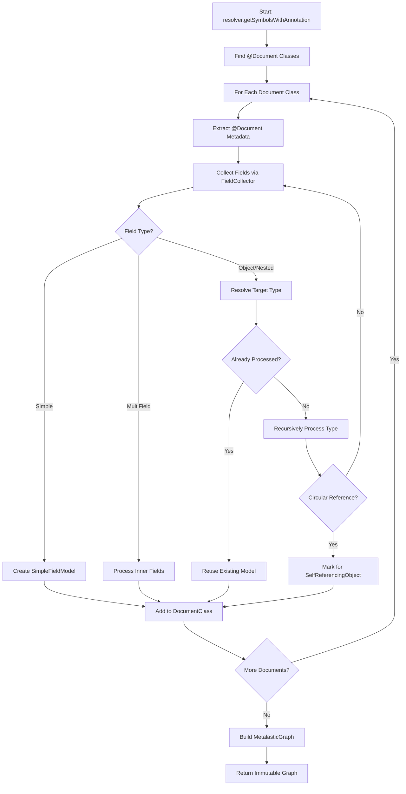

# Metalastic Processor Architecture & Functional Report

**Version**: 2.0+
**Last Updated**: 2025-10-10
**Purpose**: Comprehensive architecture and functional documentation for the Metalastic annotation processor

> **Note**: As of v2.0+, the default class prefix is `Meta` (configurable), and each generated document class includes a companion object with a singleton instance for convenient access.

---

## Table of Contents

- [Overview](#overview)
- [Architecture](#architecture)
  - [Three-Phase Processing](#three-phase-processing)
  - [Core Components](#core-components)
  - [Data Model](#data-model)
- [Phase 1: COLLECTING](#phase-1-collecting)
  - [GraphBuilder](#graphbuilder)
  - [FieldCollector](#fieldcollector)
  - [Discovery Process](#discovery-process)
- [Phase 2: BUILDING](#phase-2-building)
  - [BuildingOrchestrator](#buildingorchestrator)
  - [QClassGenerator](#qclassgenerator)
  - [MetamodelsGenerator](#metamodelsgenerator)
- [Phase 3: WRITING](#phase-3-writing)
  - [File Generation](#file-generation)
  - [Output Structure](#output-structure)
- [Configuration System](#configuration-system)
  - [MetamodelsConfiguration](#metamodelsconfiguration)
  - [Source Set Detection](#source-set-detection)
  - [KSP Arguments](#ksp-arguments)
- [Advanced Features](#advanced-features)
  - [Self-Referencing Objects](#self-referencing-objects)
  - [UnModellable Objects](#unmodellable-objects)
  - [MultiField Support](#multifield-support)
  - [Generic Type Parameters](#generic-type-parameters)
- [Field Type System](#field-type-system)
  - [Field Type Mapping](#field-type-mapping)
  - [Runtime Type Detection](#runtime-type-detection)
- [Reporting System](#reporting-system)
- [Java Compatibility](#java-compatibility)
- [Best Practices](#best-practices)
- [Troubleshooting](#troubleshooting)

---

## Overview

The Metalastic processor is a KSP (Kotlin Symbol Processing) annotation processor that generates type-safe metamodel classes for Elasticsearch documents. It transforms Spring Data Elasticsearch `@Document` annotated classes into QueryDSL-style metamodel classes with full type safety and path traversal support.

### Key Capabilities

- ✅ **Automatic Discovery**: Scans for `@Document` annotated classes
- ✅ **Type-Safe Generation**: Generates strongly-typed metamodel classes with generic parameters
- ✅ **Complex Relationships**: Handles nested objects, self-references, and circular dependencies
- ✅ **Multi-Source Sets**: Supports main, test, and custom source sets with independent configurations
- ✅ **Path Traversal**: Full dotted notation support for nested field paths
- ✅ **Java Interoperability**: Generates Java-compatible code with `@JvmField` annotations
- ✅ **MultiField Support**: Handles Spring Data ES `@MultiField` with inner fields
- ✅ **30+ Field Types**: Comprehensive support for all Elasticsearch field types
- ✅ **Debug Reporting**: Optional markdown reports with processing metrics

### What Gets Generated

For a Spring Data Elasticsearch document:

```kotlin
@Document(indexName = "users")
data class User(
    @Id
    @Field(type = FieldType.Keyword)
    val id: String,

    @Field(type = FieldType.Text)
    val name: String,

    @Field(type = FieldType.Object)
    val address: Address,

    @Field(type = FieldType.Nested)
    val tags: List<Tag>
)
```

The processor generates:

1. **Document Metamodel Class** (`MetaUser.kt`):
```kotlin
class MetaUser(
    parent: ObjectField? = null,
    fieldName: String = "",
    nested: Boolean = false,
) : Document<User>("users", parent, fieldName, nested) {
    @JvmField
    val id: KeywordField<String> = keywordField<String>("id")

    @JvmField
    val name: TextField<String> = textField<String>("name")

    @JvmField
    val address: MetaAddress = MetaAddress(this, "address", false)

    @JvmField
    val tags: MetaTag = MetaTag(this, "tags", true)

    companion object {
        @JvmStatic
        val user: MetaUser = MetaUser()
    }
}
```

2. **Centralized Registry** (`Metamodels.kt`):
```kotlin
// This file is automatically generated by Metalastic processor. Do not modify.
package com.example.search.metamodels

import com.ekino.oss.metalastic.coreDocument
import com.example.MetaUser.Companion.user
import com.example.MetaProduct.Companion.product
import jakarta.annotation.Generated
import kotlin.jvm.JvmStatic
import kotlin.sequences.Sequence

@Generated("com.ekino.oss.metalastic.processor.MetalasticSymbolProcessor", date="2025-10-09T19:10:42.643451+02:00")
object Metamodels {
    /**
     * Returns a sequence of all generated metamodel instances.
     */
    @JvmStatic
    fun entries(): Sequence<Document<*>> = sequenceOf(
        user,
        product,
    )
}
```

---

## Architecture

### Three-Phase Processing

The processor follows a clean three-phase architecture orchestrated by `MetalasticSymbolProcessor`:

```
┌─────────────────────────────────────────────────────────────┐
│                  MetalasticSymbolProcessor                  │
│                    (Entry Point & Orchestrator)             │
└─────────────────────────────────────────────────────────────┘
                              │
                              ▼
┌─────────────────────────────────────────────────────────────┐
│                     PHASE 1: COLLECTING                     │
│                                                             │
│  GraphBuilder                                               │
│  ├─ Discover @Document classes                             │
│  ├─ Resolve all object/nested field types                  │
│  ├─ Build MetalasticGraph (immutable model)                │
│  └─ Detect circular references                             │
│                                                             │
│  Output: MetalasticGraph                                    │
└─────────────────────────────────────────────────────────────┘
                              │
                              ▼
┌─────────────────────────────────────────────────────────────┐
│                     PHASE 2: BUILDING                       │
│                                                             │
│  BuildingOrchestrator                                       │
│  ├─ Generate QClass FileSpecs (KotlinPoet)                 │
│  ├─ Generate Metamodels FileSpec                           │
│  ├─ Handle SelfReferencingObject                           │
│  ├─ Handle UnModellableObject                              │
│  └─ Apply import optimization                              │
│                                                             │
│  Output: BuildingResult (List<FileSpec>)                    │
└─────────────────────────────────────────────────────────────┘
                              │
                              ▼
┌─────────────────────────────────────────────────────────────┐
│                     PHASE 3: WRITING                        │
│                                                             │
│  CodeGenerator.writeGeneratedFiles()                        │
│  ├─ Write each FileSpec to filesystem                      │
│  ├─ Create source set directories                          │
│  ├─ Add ksp generated marker                               │
│  └─ Write debug report (if enabled)                        │
│                                                             │
│  Output: .kt files in build/generated/ksp/                 │
└─────────────────────────────────────────────────────────────┘
```

### Core Components

| Component | Package | Purpose |
|-----------|---------|---------|
| `MetalasticSymbolProcessor` | `processor` | Entry point, orchestrates three phases |
| `GraphBuilder` | `processor.collecting` | Phase 1: Discovery and graph construction |
| `FieldCollector` | `processor.collecting` | Extracts and analyzes field metadata |
| `BuildingOrchestrator` | `processor.building` | Phase 2: Coordinates code generation |
| `MetaClassGenerator` | `processor.building` | Generates individual metamodel classes |
| `MetamodelsGenerator` | `processor.building` | Generates centralized registry |
| `MetalasticGraph` | `processor.model` | Immutable graph data structure |
| `FieldModel` | `processor.model` | Sealed class hierarchy for fields |
| `ProcessorReporter` | `processor` | Debug reporting and metrics |

### Data Model

The processor uses an immutable graph-based model:

```kotlin
data class MetalasticGraph(
    val documentClasses: List<DocumentClass>,
    val objectClasses: List<ObjectClass>,
) {
    sealed interface MetaClassModel {
        val parentModel: MetaClassModel?
        val sourceClassDeclaration: KSClassDeclaration
        val qClassName: String
        val fields: List<FieldModel>
        // ...
    }

    data class DocumentClass(
        val indexName: String,
        // ... MetaClassModel properties
    ) : MetaClassModel

    data class ObjectClass(
        // ... MetaClassModel properties
    ) : MetaClassModel
}
```

**Key Design Decisions:**

- **Immutable**: Graph is built once and never modified
- **Sealed Interface**: Type-safe distinction between document and object classes
- **Bidirectional**: Parent-child relationships tracked in both directions
- **Source Tracking**: Each model retains reference to original KSClassDeclaration

---

## Phase 1: COLLECTING

**Responsibility**: Discover all `@Document` classes and their dependencies, build immutable graph model

### GraphBuilder

**Location**: `modules/processor/src/main/kotlin/com/metalastic/processor/collecting/GraphBuilder.kt`

**Purpose**: Orchestrates the discovery and analysis of all document and object classes.

**Key Responsibilities:**

1. **Document Discovery**
   ```kotlin
   val documentSymbols = resolver
       .getSymbolsWithAnnotation(CoreConstants.DOCUMENT_ANNOTATION)
       .filterIsInstance<KSClassDeclaration>()
   ```

2. **Recursive Type Resolution**
   - Processes each document class
   - Identifies `@Field(type = FieldType.Object)` and `@Field(type = FieldType.Nested)` fields
   - Recursively processes referenced types
   - Builds dependency graph

3. **Circular Reference Detection**
   - Tracks processing stack to detect cycles
   - Marks circular references for special handling
   - Prevents infinite recursion

4. **Graph Construction**
   ```kotlin
   fun build(): MetalasticGraph {
       val documentClasses = mutableListOf<DocumentClass>()
       val objectClasses = mutableListOf<ObjectClass>()

       documentSymbols.forEach { processDocument(it) }

       return MetalasticGraph(documentClasses, objectClasses)
   }
   ```

### FieldCollector

**Location**: `modules/processor/src/main/kotlin/com/metalastic/processor/collecting/FieldCollector.kt`

**Purpose**: Extracts and analyzes field metadata from KSClassDeclaration.

**Field Collection Process:**

```kotlin
fun collectFields(classDeclaration: KSClassDeclaration): List<FieldModel> {
    return classDeclaration.getAllProperties()
        .filter { hasFieldAnnotation(it) }
        .map { property -> analyzeField(property) }
        .toList()
}
```

**Analysis Steps:**

1. **Find `@Field` Annotation**
   - Locates Spring Data ES `@Field` annotation
   - Extracts `type`, `name`, `format` parameters

2. **Determine Field Category**
   - **Simple**: Primitive or known Elasticsearch types
   - **Object**: Complex type requiring nested class generation
   - **MultiField**: Has `@MultiField` annotation with inner fields

3. **Extract Type Information**
   - Resolves Kotlin types to Elasticsearch field types
   - Handles generic parameters (List, Set, Map)
   - Detects nullability

4. **Create FieldModel**
   ```kotlin
   sealed class FieldModel {
       abstract val fieldType: FieldType
       abstract val fieldName: String
       abstract val propertyName: String
       abstract val kotlinType: KSType
       abstract val isNullable: Boolean
   }

   data class SimpleFieldModel(...) : FieldModel()

   data class ObjectFieldModel(
       val targetModel: MetaClassModel?,
       val isNested: Boolean,
       // ...
   ) : FieldModel()

   data class MultiFieldModel(
       val mainField: SimpleFieldModel,
       val innerFields: List<InnerFieldModel>,
       // ...
   ) : FieldModel()
   ```

### Discovery Process

**End-to-End Flow:**



**Example Output:**

For a document with nested relationships:

```kotlin
MetalasticGraph(
    documentClasses = listOf(
        DocumentClass(
            indexName = "users",
            qClassName = "MetaUser",
            fields = listOf(
                SimpleFieldModel(fieldType = KEYWORD, fieldName = "id"),
                SimpleFieldModel(fieldType = TEXT, fieldName = "name"),
                ObjectFieldModel(
                    fieldName = "address",
                    targetModel = ObjectClass(...),
                    isNested = false
                ),
                ObjectFieldModel(
                    fieldName = "tags",
                    targetModel = ObjectClass(...),
                    isNested = true
                )
            )
        )
    ),
    objectClasses = listOf(
        ObjectClass(qClassName = "MetaAddress", fields = [...]),
        ObjectClass(qClassName = "MetaTag", fields = [...])
    )
)
```

---

## Phase 2: BUILDING

**Responsibility**: Transform MetalasticGraph into KotlinPoet FileSpec objects

### BuildingOrchestrator

**Location**: `modules/processor/src/main/kotlin/com/metalastic/processor/building/BuildingOrchestrator.kt`

**Purpose**: Coordinates the generation of all Kotlin source files using KotlinPoet.

**Orchestration Flow:**

```kotlin
fun build(): BuildingResult {
    val fileSpecs = mutableListOf<FileSpec>()

    // 1. Generate document metamodel classes
    graph.documentClasses.forEach { documentClass ->
        val fileSpec = qClassGenerator.generate(documentClass)
        fileSpecs.add(fileSpec)
    }

    // 2. Generate object field classes
    graph.objectClasses.forEach { objectClass ->
        val fileSpec = qClassGenerator.generate(objectClass)
        fileSpecs.add(fileSpec)
    }

    // 3. Generate centralized Metamodels registry
    val metamodelsSpec = metamodelsGenerator.generate(graph)
    fileSpecs.add(metamodelsSpec)

    return BuildingResult(fileSpecs)
}
```

**Key Features:**

- **Parallel Processing**: Independent file specs generated in parallel (KotlinPoet is thread-safe)
- **Import Optimization**: Package proximity resolution for import conflicts
- **Documentation Generation**: KDoc comments with field hierarchy trees
- **Java Compatibility**: `@JvmField` annotations for all properties

### MetaClassGenerator

**Location**: `modules/processor/src/main/kotlin/com/metalastic/processor/building/MetaClassGenerator.kt`

**Purpose**: Generates individual metamodel class files (MetaDocument, MetaObjectField classes).

**Generation Process:**

#### 1. Class Structure

```kotlin
fun generate(model: MetaClassModel): FileSpec {
    val classBuilder = when (model) {
        is DocumentClass -> TypeSpec.classBuilder(model.qClassName)
            .superclass(ClassName(CORE_PACKAGE, "Document")
                .parameterizedBy(model.sourceClassType))
            .primaryConstructor(buildConstructor(forDocument = true))

        is ObjectClass -> TypeSpec.classBuilder(model.qClassName)
            .superclass(ClassName(CORE_PACKAGE, "ObjectField"))
            .primaryConstructor(buildConstructor(forDocument = false))
    }

    // Add field properties
    model.fields.forEach { field ->
        classBuilder.addProperty(generateFieldProperty(field))
    }

    // Add companion object with singleton instance
    if (model is DocumentClass) {
        classBuilder.addType(buildCompanionObject(model))
    }

    return FileSpec.builder(model.packageName, model.qClassName)
        .addType(classBuilder.build())
        .build()
}
```

**Constructor Pattern:**

All generated classes have uniform constructors:

```kotlin
class MetaUser(
    parent: ObjectField? = null,  // For nested path construction
    fieldName: String = "",        // Field name in parent
    nested: Boolean = false,       // Is this under a nested field?
) : Document<User>("users", parent, fieldName, nested) {
    // ... field properties

    companion object {
        @JvmStatic
        val user: MetaUser = MetaUser()
    }
}
```

#### 2. Field Property Generation

**Simple Fields:**

```kotlin
@JvmField
val id: KeywordField<String> = keywordField<String>("id")

@JvmField
val score: DoubleField<Double> = doubleField<Double>("score")
```

**Object Fields:**

```kotlin
@JvmField
val address: MetaAddress = MetaAddress(
    parent = this,
    path = "address",
    nested = false
)
```

**Nested Fields:**

```kotlin
@JvmField
val tags: MetaTag = MetaTag(
    parent = this,
    path = "tags",
    nested = true  // ← Marks this as nested
)
```

**MultiFields:**

```kotlin
@JvmField
val longCode: LongField<Long> = longField<Long>("longCode")

// Inner class for MultiField inner fields
object LongCodeFields {
    @JvmField
    val search: TextField<String> = textField<String>("longCode.search")
}
```

#### 3. Special Handling

**SelfReferencingObject:**

When a class references itself (directly or indirectly):

```kotlin
@JvmField
val parent: SelfReferencingObject<MetaUser> =
    SelfReferencingObject(this, "parent", false)
```

**UnModellableObject:**

When a field type cannot be resolved or modeled:

```kotlin
@JvmField
val metadata: UnModellableObject =
    UnModellableObject(this, "metadata", false)
```

#### 4. Documentation Generation

The generator creates comprehensive KDoc comments:

```kotlin
/**
 * Metamodel for [@Document] class [com.example.User]
 *
 * Index: users
 * Package: com.example
 *
 * Field Hierarchy:
 * ```
 * MetaUser
 * ├── id: KeywordField<String>
 * ├── name: TextField<String>
 * ├── address: MetaAddress [Object]
 * │   ├── street: TextField<String>
 * │   ├── city: TextField<String>
 * │   └── zipCode: KeywordField<String>
 * └── tags: MetaTag [Nested]
 *     ├── id: KeywordField<String>
 *     └── name: TextField<String>
 * ```
 *
 * Generated by: Metalastic v2.0.0
 */
class MetaUser(...) {
    // ... field properties

    companion object {
        @JvmStatic
        val user: MetaUser = MetaUser()
    }
}
```

### MetamodelsGenerator

**Location**: `modules/processor/src/main/kotlin/com/metalastic/processor/building/MetamodelsGenerator.kt`

**Purpose**: Generates the centralized `Metamodels` registry data object.

**Generated Structure:**

```kotlin
// This file is automatically generated by Metalastic processor. Do not modify.
package com.metalastic

import com.ekino.oss.metalastic.coreDocument
import com.example.MetaUser.Companion.user
import com.example.MetaProduct.Companion.product
import jakarta.annotation.Generated
import kotlin.jvm.JvmStatic
import kotlin.sequences.Sequence

/**
 * Centralized registry of all document metamodels.
 *
 * Access document metamodels through companion objects:
 * ```kotlin
 * import com.example.MetaUser.Companion.user
 * import com.example.MetaProduct.Companion.product
 * ```
 *
 * Or use the entries() function to iterate all metamodels:
 * ```kotlin
 * Metamodels.entries().forEach { document ->
 *     println(document.indexName)
 * }
 * ```
 *
 * Generated by: Metalastic v2.0.0
 */
@Generated(
    value = ["com.ekino.oss.metalastic.processor.MetalasticSymbolProcessor"],
    date = "2025-10-09T19:10:42.643451+02:00"
)
object Metamodels {
    /**
     * Returns a sequence of all generated metamodel instances.
     */
    @JvmStatic
    fun entries(): Sequence<Document<*>> = sequenceOf(
        user,
        product,
    )
}
```

**Key Features:**

- **object**: Singleton pattern for registry
- **@Generated**: Jakarta annotation with processor name and timestamp
- **Companion Object Imports**: Access metamodels through companion object imports
- **entries() Function**: Iterate over all metamodels dynamically
- **@JvmStatic**: Java static method access
- **KDoc**: Usage examples and documentation
- **Alphabetical Order**: Consistent ordering in entries sequence

---

## Phase 3: WRITING

**Responsibility**: Write generated FileSpec objects to the filesystem

### File Generation

**Location**: `modules/processor/src/main/kotlin/com/metalastic/processor/MetalasticSymbolProcessor.kt` (writeGeneratedFiles extension)

**Process:**

```kotlin
fun CodeGenerator.writeGeneratedFiles(
    buildingResult: BuildingResult,
    graph: MetalasticGraph
) {
    buildingResult.fileSpecs.forEach { fileSpec ->
        // Determine source set from original file path
        val sourceSet = detectSourceSet(fileSpec)

        // Write to build/generated/ksp/{sourceSet}/kotlin/
        createNewFile(
            dependencies = Dependencies(aggregating = false),
            packageName = fileSpec.packageName,
            fileName = fileSpec.name,
            extensionName = "kt"
        ).use { outputStream ->
            outputStream.writer().use { writer ->
                fileSpec.writeTo(writer)
            }
        }
    }
}
```

### Output Structure

**Directory Layout:**

```
build/generated/ksp/
├── main/
│   └── kotlin/
│       ├── com/metalastic/
│       │   └── Metamodels.kt
│       └── com/example/metamodels/
│           ├── MetaUser.kt
│           ├── MetaProduct.kt
│           ├── MetaAddress.kt (object field)
│           └── MetaTag.kt (nested field)
├── test/
│   └── kotlin/
│       ├── com/metalastic/
│       │   └── Metamodels.kt
│       └── com/example/test/metamodels/
│           └── MetaTestDocument.kt
└── integration/
    └── kotlin/
        └── ...
```

**File Naming Convention:**

- Document metamodels: `Meta{OriginalClassName}.kt`
- Object field classes: `Meta{OriginalClassName}.kt`
- Centralized registry: `Metamodels.kt` (or custom name via configuration)

**Package Structure:**

- Default package: `com.metalastic` (configurable)
- Document classes: `{configuredPackage}.{originalPackage}`
- Metamodels registry: `{configuredPackage}`

---

## Configuration System

### MetamodelsConfiguration

The processor is configured via KSP arguments, typically set through the Gradle plugin:

**Gradle DSL:**

```kotlin
metalastic {
    metamodels {
        // Global defaults
        packageName = "com.example.search"
        className = "SearchMetamodels"
        classPrefix = "Meta"

        // Source set specific
        main {
            packageName = "com.example.search.main"
            className = "MainMetamodels"
        }

        test {
            packageName = "com.example.search.test"
            className = "TestMetamodels"
        }
    }

    features {
        generateJavaCompatibility = true
        generatePrivateClassMetamodels = false
    }

    reporting {
        enabled = true
        outputPath = "build/reports/metalastic/report.md"
    }
}
```

### Source Set Detection

**Automatic Detection:**

The processor automatically detects source sets from file paths:

```kotlin
fun detectSourceSet(filePath: String): String {
    return when {
        "/src/main/kotlin/" in filePath -> "main"
        "/src/test/kotlin/" in filePath -> "test"
        "/src/integration/kotlin/" in filePath -> "integration"
        "/src/integrationTest/kotlin/" in filePath -> "integrationTest"
        "/src/functional/kotlin/" in filePath -> "functional"
        "/src/functionalTest/kotlin/" in filePath -> "functionalTest"
        "/src/e2e/kotlin/" in filePath -> "e2e"
        "/src/e2eTest/kotlin/" in filePath -> "e2eTest"
        else -> "main" // fallback
    }
}
```

**Configuration Hierarchy:**

1. Source set specific configuration (highest priority)
2. Global configuration
3. Default values (lowest priority)

### KSP Arguments

**All Supported Arguments:**

| Argument Key | Type | Default | Description |
|--------------|------|---------|-------------|
| `metamodels.package` | String | `com.metalastic` | Global package for metamodels |
| `metamodels.className` | String | `Metamodels` | Global class name for registry |
| `metamodels.classPrefix` | String | `Meta` | Prefix for generated classes |
| `metamodels.{sourceSet}.package` | String | (inherited) | Source set specific package |
| `metamodels.{sourceSet}.className` | String | (inherited) | Source set specific registry name |
| `metamodels.{sourceSet}.classPrefix` | String | (inherited) | Source set specific prefix |
| `metalastic.generateJavaCompatibility` | Boolean | `true` | Add @JvmField annotations |
| `metalastic.generatePrivateClassMetamodels` | Boolean | `false` | Process private classes |
| `metalastic.reportingPath` | String | (disabled) | Debug report output path |

**Example KSP Args (via Gradle):**

```kotlin
ksp {
    arg("metamodels.package", "com.example.search")
    arg("metamodels.main.package", "com.example.search.main")
    arg("metamodels.main.className", "MainSearchMetamodels")
    arg("metalastic.generateJavaCompatibility", "true")
    arg("metalastic.reportingPath", "build/reports/metalastic/report.md")
}
```

---

## Advanced Features

### Self-Referencing Objects

**Problem**: Some document models reference themselves (directly or through cycles):

```kotlin
@Document(indexName = "categories")
data class Category(
    @Id val id: String,
    @Field(type = FieldType.Text) val name: String,
    @Field(type = FieldType.Object) val parent: Category?,  // ← Self-reference
    @Field(type = FieldType.Nested) val children: List<Category>  // ← Self-reference
)
```

**Solution**: Generate `SelfReferencingObject<T>` for circular references:

```kotlin
class MetaCategory(
    parent: ObjectField? = null,
    fieldName: String = "",
    nested: Boolean = false,
) : Document<Category>("categories", parent, fieldName, nested) {
    @JvmField
    val id: KeywordField<String> = keywordField<String>("id")

    @JvmField
    val name: TextField<String> = textField<String>("name")

    @JvmField
    val parent: SelfReferencingObject<MetaCategory> =
        SelfReferencingObject(this, "parent", false)

    @JvmField
    val children: SelfReferencingObject<MetaCategory> =
        SelfReferencingObject(this, "children", true)

    companion object {
        @JvmStatic
        val category: MetaCategory = MetaCategory()
    }
}
```

**Usage:**

```kotlin
import com.example.MetaCategory.Companion.category

// Access self-referencing fields
category.parent.path() shouldBe "parent"
category.children.path() shouldBe "children"

// Type-safe: Compiler knows these are SelfReferencingObject<MetaCategory>
val parentField: SelfReferencingObject<MetaCategory> = category.parent
```

**Detection Algorithm:**

1. During graph building, track processing stack
2. If type is already in stack, mark as circular reference
3. In code generation, use `SelfReferencingObject<T>` instead of `QT`

### UnModellable Objects

**Problem**: Some field types cannot be fully modeled:

- Unknown/unresolved types
- Types without `@Field` annotations
- Types outside the processed module
- Generic types with complex bounds

**Solution**: Generate `UnModellableObject` as terminal field:

```kotlin
@Document(indexName = "documents")
data class Document(
    @Id val id: String,
    @Field(type = FieldType.Object) val metadata: Map<String, Any>,  // ← Can't model
    @Field(type = FieldType.Object) val config: UnknownType  // ← Can't resolve
)
```

**Generated Code:**

```kotlin
class MetaDocument(
    parent: ObjectField? = null,
    fieldName: String = "",
    nested: Boolean = false,
) : Document<Document>("documents", parent, fieldName, nested) {
    @JvmField
    val id: KeywordField<String> = keywordField<String>("id")

    @JvmField
    val metadata: UnModellableObject =
        UnModellableObject(this, "metadata", false)

    @JvmField
    val config: UnModellableObject =
        UnModellableObject(this, "config", false)

    companion object {
        @JvmStatic
        val document: MetaDocument = MetaDocument()
    }
}
```

**Usage:**

```kotlin
import com.example.MetaDocument.Companion.document

// Still have path access
document.metadata.path() shouldBe "metadata"
document.config.path() shouldBe "config"

// But no further field traversal (terminal field)
// document.metadata.someField // ← Compile error
```

### MultiField Support

**Spring Data ES MultiField:**

```java
@MultiField(
    mainField = @Field(type = FieldType.Long),
    otherFields = {
        @InnerField(suffix = "search", type = FieldType.Text),
        @InnerField(suffix = "keyword", type = FieldType.Keyword)
    }
)
private Long longCode;
```

**Generated Code:**

```kotlin
class QDocument(...) : Index(...) {
    // Main field
    @JvmField
    val longCode: LongField<Long> = longField<Long>("longCode")

    // Inner fields in nested object
    object LongCodeFields {
        @JvmField
        val search: TextField<String> = textField<String>("longCode.search")

        @JvmField
        val keyword: KeywordField<String> = keywordField<String>("longCode.keyword")
    }
}
```

**Usage:**

```kotlin
import com.example.MetaDocument.Companion.document

// Access main field
document.longCode.path() shouldBe "longCode"

// Access inner fields
document.LongCodeFields.search.path() shouldBe "longCode.search"
document.LongCodeFields.keyword.path() shouldBe "longCode.keyword"
```

**Design Rationale:**

- Main field available directly for common queries
- Inner fields grouped in companion object for clarity
- Full path support for all field variants
- Type-safe access to each field type

### Generic Type Parameters

**Type Safety Enhancement:**

All generated field types include generic parameters:

```kotlin
@JvmField
val id: KeywordField<String> = keywordField<String>("id")

@JvmField
val score: DoubleField<Double> = doubleField<Double>("score")

@JvmField
val active: BooleanField<Boolean> = booleanField<Boolean>("active")

@JvmField
val tags: TextField<List<String>> = textField<List<String>>("tags")
```

**Benefits:**

- Compile-time type checking
- IDE autocomplete and type inference
- Better error messages
- Query builder type safety

**Nullability Handling:**

```kotlin
// Non-null field
@JvmField
val name: TextField<String> = textField<String>("name")

// Nullable field
@JvmField
val nickname: TextField<String?> = textField<String?>("nickname")
```

---

## Field Type System

### Field Type Mapping

The processor supports 30+ Elasticsearch field types:

| Spring Data ES FieldType | Generated Field Class | Kotlin Type |
|---------------------------|----------------------|-------------|
| `FieldType.Keyword` | `KeywordField<String>` | String |
| `FieldType.Text` | `TextField<String>` | String |
| `FieldType.Long` | `LongField<Long>` | Long |
| `FieldType.Integer` | `IntegerField<Int>` | Int |
| `FieldType.Short` | `ShortField<Short>` | Short |
| `FieldType.Byte` | `ByteField<Byte>` | Byte |
| `FieldType.Double` | `DoubleField<Double>` | Double |
| `FieldType.Float` | `FloatField<Float>` | Float |
| `FieldType.Half_Float` | `HalfFloatField<Float>` | Float |
| `FieldType.Scaled_Float` | `ScaledFloatField<Double>` | Double |
| `FieldType.Boolean` | `BooleanField<Boolean>` | Boolean |
| `FieldType.Date` | `DateField<Date>` | java.util.Date |
| `FieldType.Date_Nanos` | `DateNanosField<Instant>` | java.time.Instant |
| `FieldType.Binary` | `BinaryField<ByteArray>` | ByteArray |
| `FieldType.Ip` | `IpField<String>` | String |
| `FieldType.Murmur3` | `Murmur3Field<String>` | String |
| `FieldType.Token_Count` | `TokenCountField<Int>` | Int |
| `FieldType.Percolator` | `PercolatorField<String>` | String |
| `FieldType.Flattened` | `FlattenedField<Map<String, Any>>` | Map |
| `FieldType.Search_As_You_Type` | `SearchAsYouTypeField<String>` | String |
| `FieldType.Rank_Feature` | `RankFeatureField<Double>` | Double |
| `FieldType.Rank_Features` | `RankFeaturesField<Map<String, Double>>` | Map |
| `FieldType.Wildcard` | `WildcardField<String>` | String |
| `FieldType.Dense_Vector` | `DenseVectorField<FloatArray>` | FloatArray |
| `FieldType.Sparse_Vector` | `SparseVectorField<Map<String, Float>>` | Map |
| `FieldType.Completion` | `CompletionField<String>` | String |
| `FieldType.Geo_Point` | `GeoPointField` | GeoPoint |
| `FieldType.Geo_Shape` | `GeoShapeField` | GeoShape |
| `FieldType.Point` | `PointField` | Point |
| `FieldType.Shape` | `ShapeField` | Shape |
| `FieldType.Object` | `Q{TypeName}` | (generated class) |
| `FieldType.Nested` | `Q{TypeName}` | (generated class) |
| `FieldType.Auto` | (runtime detection) | (inferred) |

### Runtime Type Detection

When `@Field(type = FieldType.Auto)` or no type specified:

```kotlin
@Field  // ← No type specified
val score: Double

@Field(type = FieldType.Auto)
val name: String
```

**Detection Logic:**

```kotlin
fun detectFieldType(kotlinType: KSType): FieldType {
    return when (kotlinType.declaration.qualifiedName?.asString()) {
        "kotlin.String" -> FieldType.Text
        "kotlin.Long" -> FieldType.Long
        "kotlin.Int" -> FieldType.Integer
        "kotlin.Double" -> FieldType.Double
        "kotlin.Float" -> FieldType.Float
        "kotlin.Boolean" -> FieldType.Boolean
        "java.util.Date" -> FieldType.Date
        "java.time.Instant" -> FieldType.Date_Nanos
        "java.time.LocalDate" -> FieldType.Date
        "java.time.LocalDateTime" -> FieldType.Date
        // ... more mappings
        else -> FieldType.Object  // Fallback to object
    }
}
```

---

## Reporting System

**Purpose**: Generate debug reports with processing metrics and warnings.

**Configuration:**

```kotlin
metalastic {
    reporting {
        enabled = true
        outputPath = "build/reports/metalastic/processor-report.md"
    }
}
```

**Report Structure:**

The report is an append-only markdown file that accumulates all processing runs with a table of contents for easy navigation.

```markdown
# Metalastic Processor Reports

## 📋 Table of Contents
- [Report 1 - 2025-10-09 19:10:42](#report-1---2025-10-09-191042)
- [Report 2 - 2025-10-09 19:10:48](#report-2---2025-10-09-191048)

---

## report-1---2025-10-09-191042
**Generated:** 2025-10-09 19:10:42

### 📋 Detailed Log
```
[19:10:40.513] 🔍 DEBUG: Starting Metalastic annotation processing
[19:10:42.459] 🔍 DEBUG: Found 42 Meta classes:
        com.metalastic.integration.IndexPerson
        com.metalastictest.integration.TestDocument
        com.metalastictest.integration.ExampleDocument
        ...

[19:10:42.484] 🔍 DEBUG: Collecting fields for Class: com.metalastictest.integration.TestDocument
[19:10:42.485] 🔍 DEBUG: Processing property 'id' with @Field(type = Keyword)
[19:10:42.485] 🔍 DEBUG: Processing property 'name' with @Field(type = Text)
[19:10:42.485] 🔍 DEBUG: Processing property 'address' with @Field(type = Object)
[19:10:42.485] 🔍 DEBUG: Processing property 'tags' with @Field(type = Nested)
...

[19:10:42.574] 🔍 DEBUG: 🔬 COLLECTING phase completed in 2.060684542s 📊

[19:10:42.584] 🔍 DEBUG: Generating TypeSpec for DocumentClass: MetaTestDocument
[19:10:42.601] 🔍 DEBUG: Generating nested class Address for parent MetaTestDocument
[19:10:42.601] 🔍 DEBUG: Generating TypeSpec for ObjectClass: Address
[19:10:42.603] 🔍 DEBUG: Generated document file: MetaTestDocument
...

[19:10:42.719] 🔍 DEBUG: BUILDING phase completed: 25 Meta-classes + Metamodels generated
[19:10:42.719] 🔍 DEBUG: 👷️ BUILDING phase completed in 144.903417ms 📊

[19:10:42.738] 🔍 DEBUG: Generated Meta-class: com.example.MetaTestDocument
[19:10:42.744] 🔍 DEBUG: Generated Meta-class: com.example.MetaUser
...
[19:10:42.781] 🔍 DEBUG: Generated Metamodels: com.example.search.metamodels.MainMetamodels

[19:10:42.782] 🔍 DEBUG: WRITING phase completed: 26 files written in 60ms
[19:10:42.782] 🔍 DEBUG: 📝 WRITING phase completed in 62.753458ms 📊
[19:10:42.783] 🔍 DEBUG: 🏁 Metalastic processor completed in 2.270265750s 📊
```

---

## report-2---2025-10-09-191048
**Generated:** 2025-10-09 19:10:48

### 📋 Detailed Log
```
[19:10:48.364] 🔍 DEBUG: Starting Metalastic annotation processing
[19:10:48.401] 🔍 DEBUG: Found 2 Meta classes:
        com.metalastictest.integration.DocumentInTest
        com.metalastictest.integration.other.DocumentInTest

[19:10:48.409] 🔍 DEBUG: 🔬 COLLECTING phase completed in 44.770125ms 📊
[19:10:48.426] 🔍 DEBUG: Building Metamodels registry for 2 documents
[19:10:48.426] 🔍 DEBUG: Detected source set: test
[19:10:48.426] 🔍 DEBUG: Using configured package 'com.example.test.metamodels' from option 'sourceSet-specific package for 'test''
[19:10:48.426] 🔍 DEBUG: Using configured class name 'TestMetamodels' from option 'sourceSet-specific className for 'test''
[19:10:48.427] 🔍 DEBUG: Generated Metamodels with 2 Meta-class entries
[19:10:48.450] 🔍 DEBUG: 🏁 Metalastic processor completed in 86.718667ms 📊
```
```

**Key Report Features:**

- **Append-Only**: Each build appends a new report section, preserving history
- **Table of Contents**: Auto-generated TOC with anchor links for easy navigation
- **Timestamped Sections**: Each report has unique timestamp identifier
- **Three-Phase Breakdown**: Shows COLLECTING, BUILDING, and WRITING phase timings
- **Detailed Logging**: Lists all discovered classes, field processing, and file generation
- **Configuration Tracking**: Shows detected source set and applied configuration
- **Performance Metrics**: Phase-specific timing information with emoji indicators

---

## Java Compatibility

The processor generates Java-compatible code when `metalastic.generateJavaCompatibility = true` (default).

### @JvmField Annotations

**Generated Kotlin:**

```kotlin
class MetaUser(...) {
    @JvmField
    val id: KeywordField<String> = keywordField<String>("id")

    companion object {
        @JvmStatic
        val user: MetaUser = MetaUser()
    }
}
```

**Java Usage:**

```java
import static com.example.MetaUser.user;

// Static-like field access
KeywordField<String> idField = user.id;  // ← No getter needed

// Path traversal
String path = user.address.city.path();  // users.address.city
```

**Without @JvmField** (requires getter calls):

```java
// Would require getter
KeywordField<String> idField = user.getId();  // ← Ugly
```

### Companion Object to Static Access

**Generated Kotlin:**

```kotlin
class MetaUser(...) {
    // ... fields

    companion object {
        @JvmStatic
        val user: MetaUser = MetaUser()
    }
}
```

**Java Usage:**

```java
import static com.example.MetaUser.user;

// Works seamlessly with static imports
String userName = user.name.path();

// Or without static import
String userName = MetaUser.user.name.path();
```

---

## Best Practices

### 1. Configuration Management

**✅ Recommended:**

```kotlin
// Use Gradle plugin for type-safe configuration
metalastic {
    metamodels {
        packageName = project.group.toString() + ".search"

        main {
            className = "SearchMetamodels"
        }
    }
}
```

**❌ Avoid:**

```kotlin
// Manual KSP args (error-prone, no IDE support)
ksp {
    arg("metamodels.package", "com.example.search")
}
```

### 2. Package Organization

**✅ Recommended Structure:**

```
com.example
├── domain/
│   ├── User.kt
│   ├── Product.kt
│   └── Order.kt
└── search/
    ├── Metamodels.kt
    ├── MetaUser.kt
    ├── MetaProduct.kt
    └── MetaOrder.kt
```

**Configuration:**

```kotlin
metalastic {
    metamodels {
        packageName = "com.example.search"
    }
}
```

### 3. Source Set Separation

**✅ Recommended:**

```kotlin
metalastic {
    metamodels {
        main {
            packageName = "com.example.search"
            className = "SearchMetamodels"
        }

        test {
            packageName = "com.example.search.test"
            className = "TestMetamodels"
        }
    }
}
```

**Benefits:**
- Clear separation between production and test metamodels
- Independent configuration per source set
- No naming conflicts

### 4. Field Annotations

**✅ Recommended:**

```kotlin
@Document(indexName = "users")
data class User(
    @Id
    @Field(type = FieldType.Keyword)  // ← Explicit type
    val id: String,

    @Field(type = FieldType.Text, name = "full_name")  // ← Explicit mapping
    val name: String
)
```

**❌ Avoid:**

```kotlin
@Document(indexName = "users")
data class User(
    @Id
    val id: String,  // ← No @Field, relies on auto-detection

    val name: String  // ← No annotation at all
)
```

### 5. Nested vs Object

**Use `FieldType.Nested` when:**
- Need independent scoring for array elements
- Querying individual array elements
- Array elements have complex structure

```kotlin
@Field(type = FieldType.Nested)
val addresses: List<Address>  // ← Each address scored independently
```

**Use `FieldType.Object` when:**
- Single object reference
- No array element independence needed
- Simple object embedding

```kotlin
@Field(type = FieldType.Object)
val primaryAddress: Address  // ← Single object
```

---

## Troubleshooting

### Issue 1: Metamodels Not Generated

**Symptom**: No `Metamodels.kt` file generated

**Possible Causes:**

1. **No @Document classes found**
   ```
   Solution: Ensure at least one class has @Document annotation
   ```

2. **KSP not applied**
   ```kotlin
   // Add to build.gradle.kts
   plugins {
       id("com.google.devtools.ksp") version "2.1.0-1.0.29"
   }
   ```

3. **Wrong source set**
   ```
   Check: build/generated/ksp/{sourceSet}/kotlin/
   Verify: Source set detection in processor logs
   ```

### Issue 2: SelfReferencingObject Everywhere

**Symptom**: Most fields are `SelfReferencingObject<T>` instead of proper Meta* types

**Cause**: Circular reference detection too aggressive

**Solution:**

```kotlin
// Check your document models for actual circular references
@Document(indexName = "categories")
data class Category(
    val parent: Category?  // ← Actual self-reference
)
```

**Verify**: Check processor report for circular reference warnings

### Issue 3: UnModellableObject for Valid Types

**Symptom**: Field should be object but generated as `UnModellableObject`

**Possible Causes:**

1. **Type not resolvable**
   ```
   Solution: Ensure type is in the same module or a dependency
   ```

2. **Missing @Field annotations**
   ```kotlin
   // Add @Field to nested type properties
   data class Address(
       @Field(type = FieldType.Text) val city: String,
       @Field(type = FieldType.Keyword) val zipCode: String
   )
   ```

3. **Generic type bounds**
   ```kotlin
   // Processor may struggle with complex generics
   @Field(type = FieldType.Object)
   val data: Map<String, List<ComplexType>>  // ← Hard to model
   ```

### Issue 4: Duplicate Metamodels Classes

**Symptom**: Multiple `Metamodels.kt` files, conflicts at runtime

**Cause**: Multiple source sets generating same class name

**Solution:**

```kotlin
metalastic {
    metamodels {
        main {
            className = "MainMetamodels"
        }

        test {
            className = "TestMetamodels"
        }
    }
}
```

### Issue 5: Field Path Incorrect

**Symptom**: `field.path()` returns wrong dotted notation

**Debug:**

```kotlin
// Check parent relationships
import com.example.MetaUser.Companion.user

println(user.address.city.path())  // Should be: address.city

// Verify nested flag
println(user.tags.city.isNestedPath())  // Should be: true
```

**Common Cause**: Constructor parent parameter not set correctly

**Verify Generated Code:**

```kotlin
// Should have:
val address: MetaAddress = MetaAddress(
    parent = this,  // ← Must be set
    path = "address",
    nested = false
)
```

### Issue 6: Build Performance Slow

**Symptom**: KSP processing takes a long time

**Optimization Strategies:**

1. **Enable incremental processing**
   ```kotlin
   // gradle.properties
   ksp.incremental=true
   ksp.incremental.log=true
   ```

2. **Reduce scope**
   ```kotlin
   metalastic {
       features {
           generatePrivateClassMetamodels = false
       }
   }
   ```

3. **Check report**
   ```kotlin
   metalastic {
       reporting {
           enabled = true
       }
   }
   // Review performance section
   ```

### Issue 7: IntelliJ Not Finding Generated Classes

**Symptom**: Red imports, "Unresolved reference: MetaUser"

**Solution:**

1. **Trigger KSP**
   ```bash
   ./gradlew kspKotlin
   ```

2. **Mark generated sources**
   ```kotlin
   // build.gradle.kts (should be automatic)
   kotlin {
       sourceSets.main {
           kotlin.srcDir("build/generated/ksp/main/kotlin")
       }
   }
   ```

3. **Invalidate IntelliJ caches**
   ```
   File → Invalidate Caches → Invalidate and Restart
   ```

4. **Re-import Gradle project**
   ```
   Right-click on build.gradle.kts → Reload Gradle Project
   ```

---

## Summary

The Metalastic processor provides a robust, type-safe code generation system for Elasticsearch metamodels:

- ✅ **Clean Architecture**: Three-phase separation (COLLECTING, BUILDING, WRITING)
- ✅ **Immutable Model**: Graph-based data structure prevents bugs
- ✅ **Advanced Features**: Self-references, unmodellable types, MultiFields
- ✅ **Type Safety**: Generic parameters throughout
- ✅ **Java Compatible**: @JvmField annotations for seamless interop
- ✅ **Configurable**: Per-source-set configuration via type-safe DSL
- ✅ **Debuggable**: Comprehensive reporting system
- ✅ **Maintainable**: Clear component boundaries and responsibilities

**For More Information:**

- [Metalastic README](README.md) - Project overview and usage
- [Publishing Guide](TAG_MANAGEMENT.md) - Release and versioning
- [Gradle Plugin Documentation](modules/gradle-plugin/README.md) - Configuration DSL
- [Core DSL Documentation](modules/core/README.md) - Runtime API

---

**Generated by**: Metalastic v2.0+
**Date**: 2025-10-09
