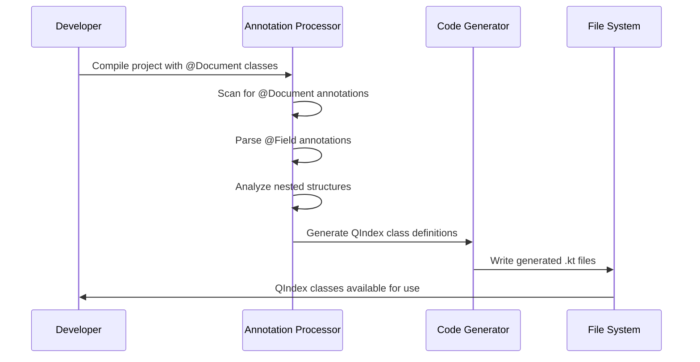

# QElasticsearch

A QueryDSL-like library for Elasticsearch in Kotlin that generates type-safe query builders from Spring Data Elasticsearch document classes.

[](https://gitlab.ekino.com/iperia/qelasticsearch/pipelines)
[](https://gitlab.ekino.com/iperia/qelasticsearch/-/packages)
[](https://openjdk.java.net/projects/jdk/21/)
[](https://kotlinlang.org/)

## Overview

QElasticsearch provides compile-time code generation to create type-safe, fluent query builders for Elasticsearch documents. Similar to how QueryDSL generates Q-classes for SQL entities, this library generates QIndex classes for Spring Data Elasticsearch `@Document` annotated classes.

## Features

- ✅ **Type-safe query construction** - Compile-time validation of field names and types
- ✅ **Fluent API** - QueryDSL-inspired syntax for building complex queries
- ✅ **Annotation processing** - Automatic generation from existing `@Document` classes
- ✅ **All field types supported** - Complete support for Elasticsearch field types
- ✅ **Nested object support** - Type-safe traversal of nested document structures
- ✅ **Path traversal** - Dotted notation support for nested field access
- ✅ **Multi-field support** - Handle complex field mappings with inner fields
- ✅ **@Document-to-@Document references** - Seamless cross-document relationships
- ✅ **Centralized registry** - Easy access to all document metamodels via `Metamodels` object
- ✅ **Constructor-based instantiation** - Classes support parent/path/nested parameters
- ✅ **Java & Kotlin compatible** - Works with both Java and Kotlin projects via `@JvmField`
- ✅ **Java 21** - Built with modern Java features and performance improvements
- ✅ **KSP-based** - Uses Kotlin Symbol Processing for efficient annotation processing
- ✅ **ktfmt Google Style** - Consistent code formatting with ktfmt

## How It Works

### Annotation Processing Flow

```mermaid
graph TD
    A[Spring Data Elasticsearch Document Classes] --> B[QElasticsearch Annotation Processor]
    B --> C[Generated QIndex Classes]
    C --> D[Type-safe Query Building]
    
    A1[@Document Class] --> B
    A2[@Field Annotations] --> B
    A3[Nested Objects] --> B
    
    B --> C1[QIndexName.kt]
    B --> C2[QNestedObject.kt]
    B --> C3[Field Properties]
    
    C1 --> D
    C2 --> D
    C3 --> D
```

### Code Generation Process



## Example Usage

### Input: Spring Data Elasticsearch Document

```java
@Document(indexName = "person")
public class Person {
    
    @Id
    @Field(type = FieldType.Keyword)
    private String id;
    
    @Field(type = FieldType.Text)
    private String name;
    
    @Field(type = FieldType.Integer)
    private Integer age;
    
    @Field(type = FieldType.Object)
    private Address address;
    
    public static class Address {
        @Field(type = FieldType.Text)
        private String city;
        
        @Field(type = FieldType.Keyword)
        private String country;
    }
}
```

### Generated: Type-safe Query Builder

#### Document Metamodel Classes

```kotlin
class QPerson(
    parent: ObjectField? = null,
    fieldName: String = "",
    nested: Boolean = false,
) : Index("person", parent, fieldName, nested) {
    @JvmField
    val id: KeywordField<String> = keywordField<String>("id")
    
    @JvmField
    val name: TextField<String> = textField<String>("name")
    
    @JvmField
    val age: IntegerField<Int> = integerField<Int>("age")
    
    @JvmField
    val address: QAddress = QAddress(this, "address", false)
    
    @JvmField
    val activities: QActivity = QActivity(this, "activities", true) // nested = true
}

class QAddress(
    parent: ObjectField?,
    path: String,
    nested: Boolean,
) : ObjectField(parent, path, nested) {
    @JvmField
    val city: TextField<String> = textField<String>("city")
    
    @JvmField
    val country: KeywordField<String> = keywordField<String>("country")
}

class QActivity(
    parent: ObjectField?,
    path: String,
    nested: Boolean,
) : ObjectField(parent, path, nested) {
    @JvmField
    val name: TextField<String> = textField<String>("name")
    
    @JvmField
    val timestamp: DateField<Date> = dateField<Date>("timestamp")
}
```

#### Central Metamodels Registry

```kotlin
@Generated("com.qelasticsearch.processor.QElasticsearchSymbolProcessor")
data object Metamodels {
    /**
     * Metamodel for @Document class [com.example.Person]
     */
    @JvmField
    val person: QPerson = QPerson()
    
    // ... other document metamodels
}
```

### Usage: Type-safe Field Access

#### Option 1: Static Access via Companion Object (Recommended)
```kotlin
// Direct static access to metamodel instances - no registry needed
import com.example.QPersonDocument

// Use companion object for direct access
QPersonDocument.personDocument.name.path() shouldBe "name"  
QPersonDocument.personDocument.age.path() shouldBe "age"

// Object fields
QPersonDocument.personDocument.address.city.path() shouldBe "address.city"
QPersonDocument.personDocument.address.country.path() shouldBe "address.country"

// Nested fields - works seamlessly
QPersonDocument.personDocument.activities.name.path() shouldBe "activities.name"
QPersonDocument.personDocument.activities.timestamp.path() shouldBe "activities.timestamp"

// Enhanced path information with nested detection
QPersonDocument.personDocument.address.city.isNestedPath() shouldBe false // object field
QPersonDocument.personDocument.activities.name.isNestedPath() shouldBe true // nested field

// Perfect for Java interop - static field access
PersonDocument.personDocument.getName().path(); // Works from Java code
```

#### Option 2: Centralized Registry Access
```kotlin
// Access document metamodel through centralized registry
val person = Metamodels.person

// Root level fields
person.path() shouldBe ""
person.name.path() shouldBe "name"
person.age.path() shouldBe "age"

// Object fields
person.address.city.path() shouldBe "address.city"
person.address.country.path() shouldBe "address.country"

// Nested fields  
person.activities.name.path() shouldBe "activities.name"
person.activities.timestamp.path() shouldBe "activities.timestamp"

// Enhanced path information with nested detection
person.address.city.isNestedPath() shouldBe false // object field
person.activities.name.isNestedPath() shouldBe true // nested field

// @Document-to-@Document references work seamlessly
val order = Metamodels.order
order.customer.name.path() shouldBe "customer.name" // customer is another @Document
order.customer.address.city.path() shouldBe "customer.address.city"

#### Why Choose Companion Object Access?

**Benefits of Static Access (Option 1):**
- ✅ **No Metamodels registry dependency** - direct import and usage
- ✅ **Better IDE support** - auto-completion works immediately after import
- ✅ **Shorter syntax** - `QPersonDocument.personDocument` vs `Metamodels.person`
- ✅ **Perfect Java interop** - static fields accessible as `QPersonDocument.personDocument`
- ✅ **Tree-shaking friendly** - only imports what you need
- ✅ **Type-safe from import** - impossible to reference wrong metamodel

**When to use Registry Access (Option 2):**
- ⚪ Legacy code migration from older QElasticsearch versions
- ⚪ Dynamic metamodel selection by string name
- ⚪ Centralized access patterns in large applications

// Use in Elasticsearch queries
val searchRequest = SearchRequest()
    .indices(person.indexName)
    .source(
        SearchSourceBuilder()
            .query(
                QueryBuilders.boolQuery()
                    .must(QueryBuilders.termQuery(person.name.path(), "John"))
                    .filter(QueryBuilders.rangeQuery(person.age.path()).gte(18))
            )
    )
```

## Supported Field Types

The library supports all Spring Data Elasticsearch field types:

| Elasticsearch Type | Kotlin DSL Method | Java Type Support |
|-------------------|-------------------|-------------------|
| `text` | `text()` | String |
| `keyword` | `keyword()` | String |
| `long` | `long()` | Long |
| `integer` | `integer()` | Integer |
| `short` | `short()` | Short |
| `byte` | `byte()` | Byte |
| `double` | `double()` | Double |
| `float` | `float()` | Float |
| `half_float` | `halfFloat()` | Float |
| `scaled_float` | `scaledFloat()` | Float |
| `date` | `date()` | Date, LocalDate, LocalDateTime |
| `date_nanos` | `dateNanos()` | Date, LocalDateTime |
| `boolean` | `boolean()` | Boolean |
| `binary` | `binary()` | byte[] |
| `object` | `objectField()` | Custom Objects |
| `nested` | `nestedField()` | Collections |
| `ip` | `ip()` | String |
| `geo_point` | `geoPoint()` | GeoPoint |
| `geo_shape` | `geoShape()` | GeoShape |
| `completion` | `completion()` | String |
| `token_count` | `tokenCount()` | Integer |
| `percolator` | `percolator()` | String |
| `rank_feature` | `rankFeature()` | Float |
| `rank_features` | `rankFeatures()` | Map |
| `flattened` | `flattened()` | Map |
| `shape` | `shape()` | Shape |
| `point` | `point()` | Point |
| `constant_keyword` | `constantKeyword()` | String |
| `wildcard` | `wildcard()` | String |
| `*_range` | `*Range()` | Range types |

## @Document-to-@Document References

The library seamlessly handles references between @Document annotated classes:

```java
@Document(indexName = "order")
public class Order {
    @Id
    @Field(type = FieldType.Keyword)
    private String id;
    
    @Field(type = FieldType.Object)
    private Customer customer; // References another @Document class
    
    @Field(type = FieldType.Date)
    private Date orderDate;
}

@Document(indexName = "customer") 
public class Customer {
    @Id
    @Field(type = FieldType.Keyword)
    private String id;
    
    @Field(type = FieldType.Text)
    private String name;
    
    @Field(type = FieldType.Object)
    private Address address;
}
```

Generates metamodels with proper cross-references:

```kotlin
class QOrder(
    parent: ObjectField? = null,
    fieldName: String = "",
    nested: Boolean = false,
) : Index("order", parent, fieldName, nested) {
    @JvmField
    val id: KeywordField<String> = keywordField<String>("id")
    
    @JvmField
    val customer: QCustomer = QCustomer(this, "customer", false) // Instantiated Q-class
    
    @JvmField
    val orderDate: DateField<Date> = dateField<Date>("orderDate")
}

class QCustomer(
    parent: ObjectField? = null,
    fieldName: String = "",
    nested: Boolean = false,
) : Index("customer", parent, fieldName, nested) {
    @JvmField
    val id: KeywordField<String> = keywordField<String>("id")
    
    @JvmField
    val name: TextField<String> = textField<String>("name")
    
    @JvmField
    val address: QAddress = QAddress(this, "address", false)
}

// Access through centralized registry
val order = Metamodels.order
order.customer.name.path() shouldBe "customer.name"
order.customer.address.city.path() shouldBe "customer.address.city"
```

## Multi-field Support

The library handles complex field mappings including multi-fields with inner fields:

```java
@MultiField(
    mainField = @Field(type = FieldType.Text),
    otherFields = {
        @InnerField(suffix = "keyword", type = FieldType.Keyword),
        @InnerField(suffix = "search", type = FieldType.Text)
    }
)
private String multiFieldName;
```

Generates:

```kotlin
class QMultiFieldName(
    parent: ObjectField?,
    path: String,
) : MultiField<TextField<String>>(parent, TextField(parent, path)) {
    @JvmField
    val keyword: KeywordField<String> = keywordField<String>("keyword")
    
    @JvmField
    val search: TextField<String> = textField<String>("search")
}

// Usage in document class:
@JvmField
val multiFieldName: QMultiFieldName = QMultiFieldName(this, "multiFieldName")

// Access patterns:
multiFieldName.path() shouldBe "multiFieldName"           // main field
multiFieldName.keyword.path() shouldBe "multiFieldName.keyword"  // inner field
multiFieldName.search.path() shouldBe "multiFieldName.search"    // inner field
```

## Installation

### As a Library Consumer

Add the GitLab Maven repository and dependencies to your `build.gradle.kts`:

```kotlin
repositories {
    mavenCentral()
    maven {
        url = uri("https://gitlab.ekino.com/api/v4/projects/{PROJECT_ID}/packages/maven")
        // No credentials needed for project members
    }
}

dependencies {
    implementation("com.qelasticsearch:core:1.0-SNAPSHOT")
    ksp("com.qelasticsearch:processor:1.0-SNAPSHOT")
}
```

For detailed consumption instructions including authentication for external users, see [PUBLISHING.md](PUBLISHING.md).

## Configuration

### KSP Options

QElasticsearch supports extensive customization through KSP (Kotlin Symbol Processing) arguments. Configure these in your `build.gradle.kts`:

```kotlin
ksp {
  // Package and Class Name Customization
  arg("metamodels.main.package", "com.example.search.metamodels")
  arg("metamodels.main.className", "SearchMetamodels")
  arg("metamodels.test.package", "com.example.test.metamodels") 
  arg("metamodels.test.className", "TestMetamodels")
  
  // Global Fallbacks
  arg("metamodels.package", "com.example.metamodels")
  arg("metamodels.className", "GlobalMetamodels")
  
  // Feature Toggles  
  arg("qelasticsearch.generateJavaCompatibility", "true") // default: true
  arg("qelasticsearch.debugLogging", "false")             // default: false
}
```

#### Package & Class Name Configuration

| Option | Description | Example | Default |
|--------|-------------|---------|---------|
| `metamodels.{sourceSet}.package` | Custom package for specific source set | `metamodels.main.package=com.example.main` | `{basePackage}.metamodels.{sourceSet}` |
| `metamodels.{sourceSet}.className` | Custom class name for specific source set | `metamodels.test.className=TestMetamodels` | `Metamodels` |
| `metamodels.package` | Global fallback package | `metamodels.package=com.example.global` | `com.qelasticsearch` |
| `metamodels.className` | Global fallback class name | `metamodels.className=GlobalMetamodels` | `Metamodels` |

#### Feature Toggles

| Option | Description | Values | Default |
|--------|-------------|---------|---------|
| `qelasticsearch.generateJavaCompatibility` | Add `@JvmField` annotations for Java interop | `true`/`false` | `true` |
| `qelasticsearch.debugLogging` | Enable detailed processor logging | `true`/`false` | `false` |

#### Configuration Resolution

The processor resolves configuration with the following priority:

1. **Source set specific**: `metamodels.main.package` > `metamodels.test.package`
2. **Global fallback**: `metamodels.package` > `metamodels.className` 
3. **Auto-detection**: Base package detection + source set suffix
4. **Default**: `com.qelasticsearch.Metamodels`

#### Examples

**Basic Customization:**
```kotlin
ksp {
  arg("metamodels.main.package", "com.myapp.search")
  arg("metamodels.main.className", "SearchAPI")
}
```
Generates: `com.myapp.search.SearchAPI`

**Multi-Module Project:**
```kotlin 
// In search-service module
ksp {
  arg("metamodels.package", "com.myapp.search.metamodels")
  arg("metamodels.className", "SearchMetamodels")
}

// In analytics-service module  
ksp {
  arg("metamodels.package", "com.myapp.analytics.metamodels")
  arg("metamodels.className", "AnalyticsMetamodels")
}
```

**Development vs Production:**
```kotlin
ksp {
  arg("metamodels.main.package", "com.myapp.search")
  arg("metamodels.test.package", "com.myapp.search.testing")
  arg("qelasticsearch.debugLogging", "true") // For development
}
```

**Debug Logging Example:**
When `debugLogging` is enabled, the processor outputs detailed information:
```
> Task :compileKotlin
i: [ksp] Processing 3 document classes
i: [ksp] [DEBUG] Found document classes: [com.example.Person, com.example.Order, com.example.Product]
i: [ksp] [DEBUG] Starting object field collection phase
i: [ksp] [DEBUG] Collecting object fields from: com.example.Person
i: [ksp] [DEBUG] Collected 2 global object fields: [Address, Contact]
i: [ksp] [DEBUG] Starting document class generation phase
i: [ksp] [DEBUG] Processing document class: com.example.Person
i: [ksp] [DEBUG] Document details: package=com.example, indexName=person, className=Person
i: [ksp] [DEBUG] Generating Q-class for: Person
i: [ksp] [DEBUG:FieldGenerators] Processing @QDynamicField property: runtimeScore with type: Double
i: [ksp] [DEBUG] Generated Q-class structure, writing file: QPerson
i: [ksp] Generated file: com.example.QPerson
i: [ksp] [DEBUG] Processing completed successfully
```

#### Validation

The processor validates all configuration:
- **Package names**: Must be valid Java package identifiers
- **Class names**: Must start with uppercase letter and be valid identifiers  
- **Boolean values**: Must be `"true"` or `"false"` (case-insensitive)
- **Invalid values**: Logged as warnings and ignored (defaults used)

### Development Setup

Clone and build the library:

```bash
git clone https://gitlab.ekino.com/iperia/qelasticsearch.git
cd qelasticsearch
./gradlew build
```

### Building and Testing

- **Build all modules**: `./gradlew build`
- **Format code**: `./gradlew spotlessApply`
- **Check formatting**: `./gradlew spotlessCheck`
- **Run all checks**: `./gradlew check`
- **Test DSL module**: `./gradlew :modules:core:test`
- **Test processor module**: `./gradlew :modules:processor:test`
- **Test integration**: `./gradlew :modules:test:test`
- **Publish locally**: `./gradlew publishToMavenLocal`

## Version Compatibility

QElasticsearch is designed to work with different versions of Spring Data Elasticsearch through **runtime detection**:

### How It Works

The annotation processor uses a sophisticated version compatibility system that:

1. **Detects available FieldType enum values** at runtime
2. **Gracefully handles missing enum values** in older Spring Data Elasticsearch versions
3. **Automatically supports newer field types** when available
4. **Provides comprehensive logging** of unsupported field types

### Implementation Details

```kotlin
// Runtime detection approach in QElasticsearchSymbolProcessor
private fun safeAddMapping(
    mappings: MutableMap<FieldType, FieldTypeMapping>,
    fieldTypeName: String,
    delegate: String,
    className: String,
) {
    try {
        val fieldType = FieldType.valueOf(fieldTypeName)
        mappings[fieldType] = FieldTypeMapping(delegate, className)
    } catch (e: IllegalArgumentException) {
        // FieldType enum value doesn't exist in this version - skip it
        logger.info("Skipping unsupported FieldType: $fieldTypeName")
    }
}
```

### Supported Spring Data Elasticsearch Versions

| Version | Status | Notes |
|---------|--------|-------|
| 5.0.x | ✅ Fully supported | Core field types available |
| 5.1.x | ✅ Fully supported | Additional field types auto-detected |
| 5.2.x | ✅ Fully supported | Enhanced field type support |
| 5.3.x+ | ✅ Fully supported | Newest field types auto-detected |

### Benefits

- **Zero Configuration** - No version-specific setup required
- **Forward Compatible** - Automatically supports new field types in newer versions
- **Backward Compatible** - Works with older Spring Data Elasticsearch versions
- **Safe Degradation** - Unknown field types are logged but don't break compilation
- **No Dependency Conflicts** - Uses the Spring Data Elasticsearch version from your project

### Troubleshooting Version Issues

If you encounter version-related issues:

1. **Check processor logs** for "Skipping unsupported FieldType" messages
2. **Verify your Spring Data Elasticsearch version** in your build configuration
3. **Ensure field types exist** in your version by checking the Spring Data documentation
4. **Update Spring Data Elasticsearch** if you need newer field types

### Why Runtime Detection Over Dependency Shading?

We initially considered dependency shading (relocating Spring Data Elasticsearch classes), but chose runtime detection for several important reasons:

**Runtime Detection Advantages:**
- **Simpler build process** - No complex shadow JAR configuration
- **Zero configuration** - Works automatically with any Spring Data Elasticsearch version  
- **Cleaner dependencies** - Uses the project's own Spring Data Elasticsearch version
- **Better IDE support** - No confusion with relocated packages
- **Easier debugging** - Stack traces show familiar package names
- **Future-proof** - Automatically supports new FieldType enum values

**Shading Disadvantages:**
- **Complex build setup** - Requires shadow plugin and relocation configuration
- **Larger JAR size** - Embeds duplicate dependencies
- **IDE confusion** - Code completion and navigation work with different package names than runtime
- **Debugging complexity** - Stack traces show relocated package names
- **Maintenance overhead** - Need to maintain relocation mappings

The runtime detection approach provides maximum compatibility and ease of use while keeping the implementation clean and maintainable.

## Code Quality

This project follows strict code quality standards:

- **No star imports** - All imports are explicit
- **ktfmt Google Style** - Consistent code formatting with ktfmt
- **Spotless** - Automated code formatting enforcement
- **detekt** - Static code analysis for Kotlin
- **100% Kotlin** - Kotlin-first design with Java interoperability
- **Kotest v5.9.1** - ShouldSpec format for all tests (no JUnit)
- **KotlinLogging** - Structured logging for tests (no println statements)
- **KSP** - Kotlin Symbol Processing for annotation processing

## Architecture

### Multi-Module Project Structure

```
QElasticsearch/
├── build.gradle.kts              # Root build configuration
├── settings.gradle.kts           # Multi-module settings
├── modules/                     # All project modules
│   ├── core/                    # Core DSL runtime
│   │   ├── src/main/kotlin/     # DSL classes (Index, ObjectFields, etc.)
│   │   └── src/test/kotlin/     # DSL unit tests
│   ├── processor/               # Annotation processor
│   │   ├── src/main/kotlin/     # Processor implementation
│   │   └── src/test/kotlin/     # Processor tests
│   └── test/                    # Integration tests
│       └── src/test/kotlin/     # End-to-end tests
```

### Key Components

1. **core** - Core DSL runtime with field definitions and base classes
2. **processor** - Annotation processor that scans `@Document` classes and generates metamodels
3. **test** - Integration tests ensuring the processor works correctly
4. **Metamodel Generation** - Two-tier generation: document classes + centralized registry
5. **Path Traversal** - Dotted notation support for nested fields with parent hierarchy
6. **Import Management** - Advanced import optimization with conflict resolution

### Architecture Design

#### Metamodel Generation Pattern

The library follows a **two-tier generation pattern**:

1. **Document Metamodel Classes**: Regular Kotlin classes that can be instantiated with constructor parameters, enabling @Document-to-@Document references
2. **Centralized Registry**: A `Metamodels` data object that provides singleton-like access to all document metamodels

#### Key Design Decisions

- **Classes over Data Objects**: Document metamodels are generated as regular classes (not data objects) to support constructor parameters for parent/path/nested relationships
- **Default Constructor Values**: All constructors have default values (`parent: ObjectField? = null, fieldName: String = "", nested: Boolean = false`) for clean instantiation
- **@JvmField Annotations**: All field properties are annotated with `@JvmField` for optimal Java interoperability
- **Path Building**: Automatic path construction through parent hierarchy traversal supports deep nested structures
- **Import Optimization**: Advanced import management with package proximity prioritization and conflict resolution

## Contributing

1. Follow the established code style (ktfmt Google Style + detekt)
2. Run `./gradlew spotlessApply` to format code before committing
3. No star imports - all imports must be explicit
4. Write tests for new features using Kotest ShouldSpec format
5. Use KotlinLogging for test output (no println statements)
6. Use KSP for annotation processing (not kapt)
7. Update documentation for API changes
8. Ensure all checks pass: `./gradlew check`


## GitLab Repository

This project is hosted on GitLab at:
- **Repository**: https://gitlab.ekino.com/iperia/qelasticsearch
- **CI/CD Pipelines**: https://gitlab.ekino.com/iperia/qelasticsearch/pipelines
- **Package Registry**: https://gitlab.ekino.com/iperia/qelasticsearch/-/packages

## Roadmap

- [x] **Multi-module project structure** - Separate DSL runtime, processor, and integration tests
- [x] **Core DSL runtime classes** - Index, ObjectFields, Field hierarchy with sealed classes
- [x] **All field types support** - Complete implementation of all Elasticsearch field types
- [x] **Path traversal implementation** - Dotted notation for nested field access with enhanced FieldPath
- [x] **Object field traversal** - Direct access to nested object fields
- [x] **Type-safe field system** - Sealed classes instead of string-based approach
- [x] **Annotation processor implementation** - KSP-based processor for @Document classes
- [x] **Code generation for all field types** - Complete field type mapping and generation
- [x] **Multi-field and nested object support** - @MultiField and nested object handling
- [x] **Nested field detection** - Enhanced path system with nested segment tracking
- [x] **Generated class documentation** - JavaDoc comments with source class references
- [x] **Specific Q-classes for all referenced types** - Generate type-safe Q-classes even for classes without @Field annotations
- [x] **@Document-to-@Document references** - Seamless cross-document relationships with class-based instantiation
- [x] **Centralized Metamodels registry** - Easy access to all document metamodels via `Metamodels` data object
- [x] **Advanced import management** - Package proximity prioritization and conflict resolution
- [x] **Java compatibility** - `@JvmField` annotations for optimal Java interoperability
- [ ] Query building DSL - Fluent query construction API
- [ ] Integration with Elasticsearch clients - Direct query execution
- [ ] Performance optimizations - Processor and runtime optimizations
- [ ] Enhanced documentation and examples - Comprehensive usage guides