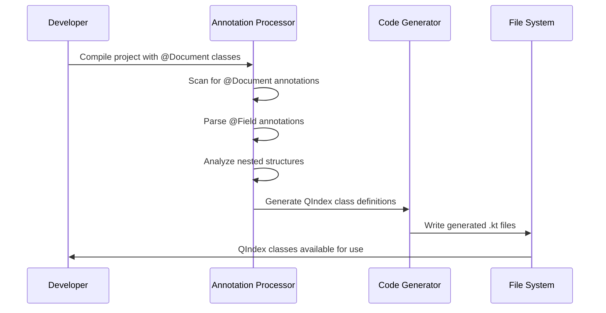

# QElasticsearch

A QueryDSL-like library for Elasticsearch in Kotlin that generates type-safe query builders from Spring Data Elasticsearch document classes.

## Overview

QElasticsearch provides compile-time code generation to create type-safe, fluent query builders for Elasticsearch documents. Similar to how QueryDSL generates Q-classes for SQL entities, this library generates QIndex classes for Spring Data Elasticsearch `@Document` annotated classes.

## Features

- ✅ **Type-safe query construction** - Compile-time validation of field names and types
- ✅ **Fluent API** - QueryDSL-inspired syntax for building complex queries
- ✅ **Annotation processing** - Automatic generation from existing `@Document` classes
- ✅ **All field types supported** - Complete support for Elasticsearch field types
- ✅ **Nested object support** - Type-safe traversal of nested document structures
- ✅ **Path traversal** - Dotted notation support for nested field access
- ✅ **Multi-field support** - Handle complex field mappings with inner fields
- ✅ **Java & Kotlin compatible** - Works with both Java and Kotlin projects
- ✅ **Java 21** - Built with modern Java features and performance improvements

## How It Works

### Annotation Processing Flow

```mermaid
graph TD
    A[Spring Data Elasticsearch Document Classes] --> B[QElasticsearch Annotation Processor]
    B --> C[Generated QIndex Classes]
    C --> D[Type-safe Query Building]
    
    A1[@Document Class] --> B
    A2[@Field Annotations] --> B
    A3[Nested Objects] --> B
    
    B --> C1[QIndexName.kt]
    B --> C2[QNestedObject.kt]
    B --> C3[Field Properties]
    
    C1 --> D
    C2 --> D
    C3 --> D
```

### Code Generation Process



## Example Usage

### Input: Spring Data Elasticsearch Document

```java
@Document(indexName = "person")
public class Person {
    
    @Id
    @Field(type = FieldType.Keyword)
    private String id;
    
    @Field(type = FieldType.Text)
    private String name;
    
    @Field(type = FieldType.Integer)
    private Integer age;
    
    @Field(type = FieldType.Object)
    private Address address;
    
    public static class Address {
        @Field(type = FieldType.Text)
        private String city;
        
        @Field(type = FieldType.Keyword)
        private String country;
    }
}
```

### Generated: Type-safe Query Builder

```kotlin
object QPerson : Index("person") {
    val id by keyword()
    val name by text()
    val age by integer()
    val address by objectField(QAddress)
}

object QAddress : ObjectFields() {
    val city by text()
    val country by keyword()
}
```

### Usage: Type-safe Field Access

```kotlin
// Type-safe field access with path traversal
val person = QPerson

// Root level fields
assertThat(person.path).isEqualTo("")
assertThat(person.name.path).isEqualTo("name")
assertThat(person.age.path).isEqualTo("age")

// Nested object fields
assertThat(person.address.city.path).isEqualTo("address.city")
assertThat(person.address.country.path).isEqualTo("address.country")

// Enhanced path information with nested detection
assertThat(person.address.city.fieldPath.isNested).isFalse() // object field
assertThat(person.activities.name.fieldPath.isNested).isTrue() // nested field

// Use in Elasticsearch queries
val searchRequest = SearchRequest()
    .indices(person.indexName)
    .source(
        SearchSourceBuilder()
            .query(
                QueryBuilders.boolQuery()
                    .must(QueryBuilders.termQuery(person.name.path, "John"))
                    .filter(QueryBuilders.rangeQuery(person.age.path).gte(18))
            )
    )
```

## Supported Field Types

The library supports all Spring Data Elasticsearch field types:

| Elasticsearch Type | Kotlin DSL Method | Java Type Support |
|-------------------|-------------------|-------------------|
| `text` | `text()` | String |
| `keyword` | `keyword()` | String |
| `long` | `long()` | Long |
| `integer` | `integer()` | Integer |
| `short` | `short()` | Short |
| `byte` | `byte()` | Byte |
| `double` | `double()` | Double |
| `float` | `float()` | Float |
| `half_float` | `halfFloat()` | Float |
| `scaled_float` | `scaledFloat()` | Float |
| `date` | `date()` | Date, LocalDate, LocalDateTime |
| `date_nanos` | `dateNanos()` | Date, LocalDateTime |
| `boolean` | `boolean()` | Boolean |
| `binary` | `binary()` | byte[] |
| `object` | `objectField()` | Custom Objects |
| `nested` | `nestedField()` | Collections |
| `ip` | `ip()` | String |
| `geo_point` | `geoPoint()` | GeoPoint |
| `geo_shape` | `geoShape()` | GeoShape |
| `completion` | `completion()` | String |
| `token_count` | `tokenCount()` | Integer |
| `percolator` | `percolator()` | String |
| `rank_feature` | `rankFeature()` | Float |
| `rank_features` | `rankFeatures()` | Map |
| `flattened` | `flattened()` | Map |
| `shape` | `shape()` | Shape |
| `point` | `point()` | Point |
| `constant_keyword` | `constantKeyword()` | String |
| `wildcard` | `wildcard()` | String |
| `*_range` | `*Range()` | Range types |

## Multi-field Support

The library handles complex field mappings including multi-fields with inner fields:

```java
@MultiField(
    mainField = @Field(type = FieldType.Long),
    otherFields = {
        @InnerField(suffix = "search", type = FieldType.Text)
    }
)
private Long longCode;
```

Generates:

```kotlin
val longCode by multiField(long()) {
    field("search", text())
}
```

## Installation

### As a Library Consumer

Add the dependency to your `build.gradle.kts`:

```kotlin
dependencies {
    implementation("com.yourorg:qelasticsearch-runtime:1.0.0")
    ksp("com.yourorg:qelasticsearch-processor:1.0.0")
}
```

### Development Setup

Clone and build the library:

```bash
git clone https://github.com/yourorg/qelasticsearch.git
cd qelasticsearch
./gradlew build
```

### Building and Testing

- **Build all modules**: `./gradlew build`
- **Test DSL module**: `./gradlew :qelasticsearch-dsl:test`
- **Test processor module**: `./gradlew :qelasticsearch-processor:test`
- **Test integration**: `./gradlew :qelasticsearch-test:test`

## Version Compatibility

QElasticsearch is designed to work with different versions of Spring Data Elasticsearch through **runtime detection**:

### How It Works

The annotation processor uses a sophisticated version compatibility system that:

1. **Detects available FieldType enum values** at runtime
2. **Gracefully handles missing enum values** in older Spring Data Elasticsearch versions
3. **Automatically supports newer field types** when available
4. **Provides comprehensive logging** of unsupported field types

### Implementation Details

```kotlin
// Runtime detection approach in QElasticsearchSymbolProcessor
private fun safeAddMapping(
    mappings: MutableMap<FieldType, FieldTypeMapping>,
    fieldTypeName: String,
    delegate: String,
    className: String,
) {
    try {
        val fieldType = FieldType.valueOf(fieldTypeName)
        mappings[fieldType] = FieldTypeMapping(delegate, className)
    } catch (e: IllegalArgumentException) {
        // FieldType enum value doesn't exist in this version - skip it
        logger.info("Skipping unsupported FieldType: $fieldTypeName")
    }
}
```

### Supported Spring Data Elasticsearch Versions

| Version | Status | Notes |
|---------|--------|-------|
| 5.0.x | ✅ Fully supported | Core field types available |
| 5.1.x | ✅ Fully supported | Additional field types auto-detected |
| 5.2.x | ✅ Fully supported | Enhanced field type support |
| 5.3.x+ | ✅ Fully supported | Newest field types auto-detected |

### Benefits

- **Zero Configuration** - No version-specific setup required
- **Forward Compatible** - Automatically supports new field types in newer versions
- **Backward Compatible** - Works with older Spring Data Elasticsearch versions
- **Safe Degradation** - Unknown field types are logged but don't break compilation
- **No Dependency Conflicts** - Uses the Spring Data Elasticsearch version from your project

### Troubleshooting Version Issues

If you encounter version-related issues:

1. **Check processor logs** for "Skipping unsupported FieldType" messages
2. **Verify your Spring Data Elasticsearch version** in your build configuration
3. **Ensure field types exist** in your version by checking the Spring Data documentation
4. **Update Spring Data Elasticsearch** if you need newer field types

### Why Runtime Detection Over Dependency Shading?

We initially considered dependency shading (relocating Spring Data Elasticsearch classes), but chose runtime detection for several important reasons:

**Runtime Detection Advantages:**
- **Simpler build process** - No complex shadow JAR configuration
- **Zero configuration** - Works automatically with any Spring Data Elasticsearch version  
- **Cleaner dependencies** - Uses the project's own Spring Data Elasticsearch version
- **Better IDE support** - No confusion with relocated packages
- **Easier debugging** - Stack traces show familiar package names
- **Future-proof** - Automatically supports new FieldType enum values

**Shading Disadvantages:**
- **Complex build setup** - Requires shadow plugin and relocation configuration
- **Larger JAR size** - Embeds duplicate dependencies
- **IDE confusion** - Code completion and navigation work with different package names than runtime
- **Debugging complexity** - Stack traces show relocated package names
- **Maintenance overhead** - Need to maintain relocation mappings

The runtime detection approach provides maximum compatibility and ease of use while keeping the implementation clean and maintainable.

## Code Quality

This project follows strict code quality standards:

- **No star imports** - All imports are explicit
- **ktlint** - Code formatting and style checks
- **detekt** - Static code analysis
- **100% Kotlin** - Kotlin-first design with Java interoperability

## Architecture

### Multi-Module Project Structure

```
QElasticsearch/
├── build.gradle.kts              # Root build configuration
├── settings.gradle.kts           # Multi-module settings
├── qelasticsearch-dsl/          # Core DSL runtime
│   ├── src/main/kotlin/         # DSL classes (Index, ObjectFields, etc.)
│   └── src/test/kotlin/         # DSL unit tests
├── qelasticsearch-processor/    # Annotation processor
│   ├── src/main/kotlin/         # Processor implementation
│   └── src/test/kotlin/         # Processor tests
└── qelasticsearch-test/         # Integration tests
    └── src/test/kotlin/         # End-to-end tests
```

### Key Components

1. **qelasticsearch-dsl** - Core DSL runtime with field definitions and base classes
2. **qelasticsearch-processor** - Annotation processor that scans `@Document` classes
3. **qelasticsearch-test** - Integration tests ensuring the processor works correctly
4. **Path Traversal** - Dotted notation support for nested fields

## Contributing

1. Follow the established code style (ktlint + detekt)
2. No star imports
3. Write tests for new features
4. Update documentation for API changes

## License

[Your License Here]

## Roadmap

- [x] **Multi-module project structure** - Separate DSL runtime, processor, and integration tests
- [x] **Core DSL runtime classes** - Index, ObjectFields, Field hierarchy with sealed classes
- [x] **All field types support** - Complete implementation of all Elasticsearch field types
- [x] **Path traversal implementation** - Dotted notation for nested field access with enhanced FieldPath
- [x] **Object field traversal** - Direct access to nested object fields
- [x] **Type-safe field system** - Sealed classes instead of string-based approach
- [x] **Annotation processor implementation** - KSP-based processor for @Document classes
- [x] **Code generation for all field types** - Complete field type mapping and generation
- [x] **Multi-field and nested object support** - @MultiField and nested object handling
- [x] **Nested field detection** - Enhanced path system with nested segment tracking
- [x] **Generated class documentation** - JavaDoc comments with source class references
- [x] **Semantic placeholders** - UnknownObjectFields/UnknownNestedFields for incomplete mappings
- [ ] Query building DSL - Fluent query construction API
- [ ] Integration with Elasticsearch clients - Direct query execution
- [ ] Performance optimizations - Processor and runtime optimizations
- [ ] Enhanced documentation and examples - Comprehensive usage guides