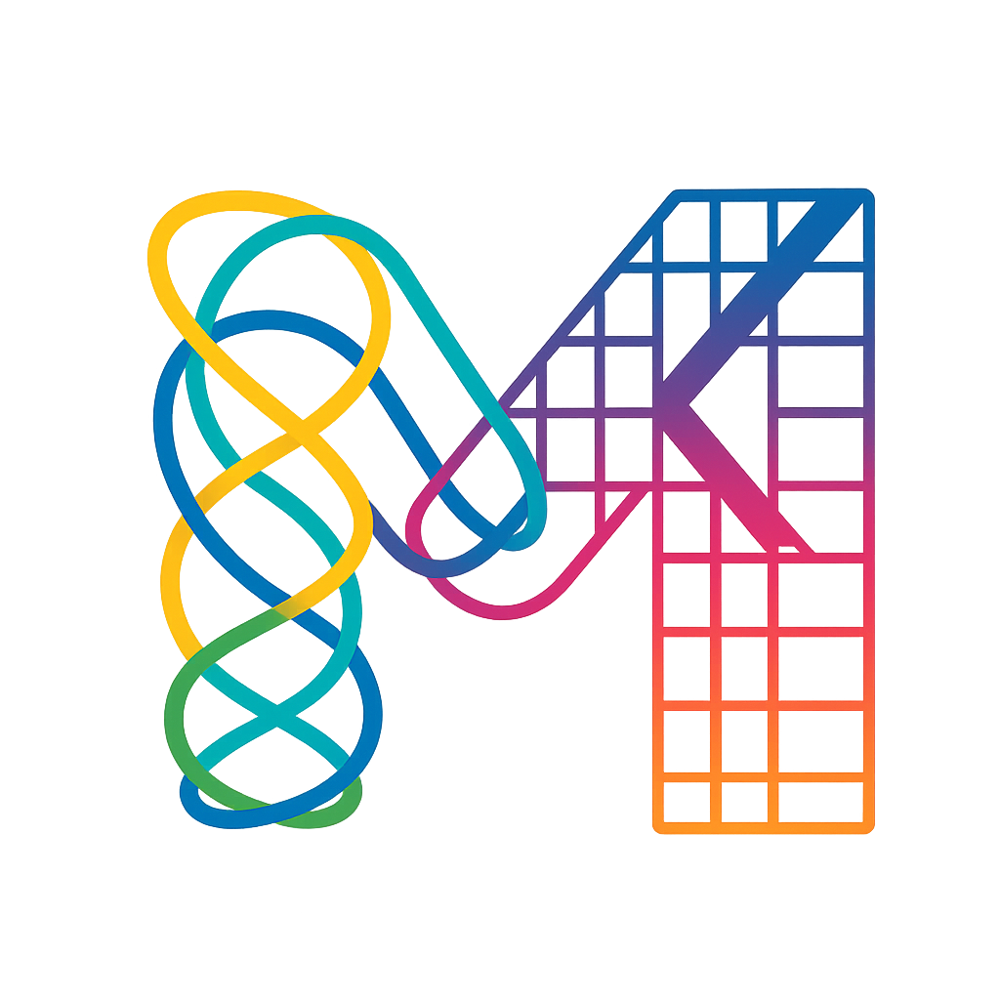

<div align="center">
  

  # Metalastic

  Type-safe metamodel generator for Elasticsearch in Kotlin. Automatically generates compile-time validated field accessors from Spring Data Elasticsearch documents.
</div>

[](https://github.com/ekino/Metalastic/actions)
[](https://central.sonatype.com/search?q=com.ekino.oss.metalastic)
[](https://opensource.org/licenses/MIT)
[](https://openjdk.java.net/projects/jdk/21/)
[](https://kotlinlang.org/)
[](https://docs.spring.io/spring-data/elasticsearch/docs/current/reference/html/)

---

## 📚 Documentation

**👉 [Read the full documentation at ekino.github.io/Metalastic](https://ekino.github.io/Metalastic/)**

---

## What is Metalastic?

Metalastic is a **compile-time code generator** that transforms your Spring Data Elasticsearch `@Document` classes into type-safe metamodels. It eliminates string-based field names and provides full IDE support for building Elasticsearch queries.

## Why Use Metalastic?

- 🚫 **No more typos** - Compile-time validation prevents `"staus"` → `"status"` errors
- 🔍 **IDE autocomplete** - Full IntelliSense for nested document structures
- 🛡️ **Type safety** - Compile-time verification of field types and relationships
- 📦 **Zero runtime overhead** - All code generation happens at compile time
- 🔄 **Automatic refactoring** - Rename fields once, queries update everywhere
- ⚡ **Optional Query DSL** - Fluent API with innovative operator syntax

**[Learn more about features →](https://ekino.github.io/Metalastic/)**

## Quick Start

### 1. Add the Gradle Plugin

```kotlin
// build.gradle.kts
plugins {
    kotlin("jvm") version "2.3.10"
    id("com.google.devtools.ksp") version "2.3.6"
    id("com.ekino.oss.metalastic") version "1.2.2"
}

repositories {
    mavenCentral()
}
```

### 2. Build Your Project

```bash
./gradlew build
```

Metamodels are automatically generated in `build/generated/ksp/main/kotlin/`

### 3. Use Generated Metamodels

```kotlin
import com.example.MetaProduct.Companion.product

// Type-safe field access
product.title.path()          // "title"
product.category.name.path()  // "category.name"

// Use in queries
QueryBuilders.termQuery(product.status.path(), "ACTIVE")
```

**[Full Getting Started Guide →](https://ekino.github.io/Metalastic/guide/getting-started)**

## Example: The Problem & Solution

### Before: String-Based Field Names ❌

```kotlin
// Error-prone string literals
NativeSearchQuery query = new NativeSearchQueryBuilder()
    .withQuery(
        QueryBuilders.boolQuery()
            .must(QueryBuilders.termQuery("staus", "active"))  // ❌ Typo!
            .filter(QueryBuilders.rangeQuery("prcie").gte(100)) // ❌ Typo!
    )
    .build();

// No IDE support, no refactoring, errors found at runtime 😞
```

### After: Type-Safe Metamodels ✅

```kotlin
import com.example.MetaProduct.Companion.product

// Compile-time validated
val query = QueryBuilders.boolQuery()
    .must(QueryBuilders.termQuery(product.status.path(), "active"))
    .filter(QueryBuilders.rangeQuery(product.price.path()).gte(100))

// IDE autocomplete, refactoring support, compile-time safety 🎉
```

### With Optional Query DSL ✨

```kotlin
import com.metalastic.dsl.*
import com.example.MetaProduct.Companion.product

val query = BoolQuery.of {
    boolQueryDsl {
        must + {
            product.title match "laptop"
            product.status term ProductStatus.ACTIVE
        }

        filter + {
            product.price range 500.0.fromInclusive()..2000.0
            product.category.name term "electronics"
        }
    }
}
```

**[More Examples →](https://ekino.github.io/Metalastic/guide/examples)**

## Documentation

### Getting Started
- 📖 [Quick Start Guide](https://ekino.github.io/Metalastic/guide/getting-started) - Get up and running in 5 minutes
- ⚙️ [Configuration](https://ekino.github.io/Metalastic/guide/configuration) - Customize metamodel generation

### Core Concepts
- 🎯 [Understanding Metamodels](https://ekino.github.io/Metalastic/guide/understanding-metamodels) - How generation works
- 📝 [Field Types Reference](https://ekino.github.io/Metalastic/guide/field-types-reference) - All supported field types
- 🔍 [Query DSL Guide](https://ekino.github.io/Metalastic/guide/query-dsl-guide) - Type-safe query building

### Examples & Advanced Usage
- 💡 [Complete Examples](https://ekino.github.io/Metalastic/guide/examples) - Real-world use cases
- 🔧 [Advanced Features](https://ekino.github.io/Metalastic/guide/field-types-reference#advanced-features) - MultiField, nested, circular references

## Installation Options

### Using Gradle Plugin (Recommended)

```kotlin
plugins {
    id("com.google.devtools.ksp") version "2.3.6"
    id("com.ekino.oss.metalastic") version "1.2.2"
}
```

### Manual Dependencies

```kotlin
dependencies {
    implementation("com.ekino.oss:metalastic-core:1.2.2")
    ksp("com.ekino.oss:metalastic-processor:1.2.2")

    // Optional: Query DSL module
    implementation("com.ekino.oss:metalastic-elasticsearch-dsl:1.2.2")
}
```

**[Detailed installation instructions →](https://ekino.github.io/Metalastic/guide/getting-started)**

## Version Compatibility

| Spring Data ES | Elasticsearch | Metalastic Core | Query DSL Artifact |
|----------------|---------------|-----------------|-------------------|
| 6.0.x | 8.18.x | ✅ 1.2.2 | `metalastic-elasticsearch-dsl:1.2.2` |
| 5.4.x - 5.5.x | 8.15.x - 8.18.x | ✅ 1.2.2 | `metalastic-elasticsearch-dsl-5.5:1.2.2` |
| 5.0.x - 5.3.x | 8.5.x - 8.13.x | ✅ 1.2.2 | `metalastic-elasticsearch-dsl-5.3:1.2.2` |

**[Full compatibility matrix →](https://ekino.github.io/Metalastic/#compatibility)**

## Key Features

### Core Module (Required)
- ✅ Type-safe field access with `path()` methods
- ✅ Automatic dotted notation for nested structures
- ✅ All Elasticsearch field types supported
- ✅ MultiField support with inner fields
- ✅ Circular reference handling
- ✅ Centralized metamodels registry
- ✅ Java & Kotlin compatible

### Query DSL Module (Optional)
- ✅ Innovative `clause + { }` operator syntax
- ✅ Mathematical notation for ranges (`10.fromInclusive()..100`)
- ✅ Type-safe nested queries
- ✅ Automatic value conversion (dates, enums, collections)
- ✅ Full Elasticsearch query type support

**[Explore all features →](https://ekino.github.io/Metalastic/)**

## Contributing

We welcome contributions! Here's how to get started:

1. **Fork** the repository
2. **Create** a feature branch: `git checkout -b feature/amazing-feature`
3. **Make** your changes following our code style:
   ```bash
   ./gradlew spotlessApply  # Format code
   ./gradlew check          # Run all checks
   ```
4. **Commit** your changes: `git commit -m 'Add amazing feature'`
5. **Push** to your branch: `git push origin feature/amazing-feature`
6. **Open** a Pull Request

**Code Style:**
- Use [ktfmt Google Style](https://github.com/facebookincubator/ktfmt)
- No star imports
- Write tests with [Kotest](https://kotest.io/)

**[Development guide →](https://ekino.github.io/Metalastic/development)**

## Building from Source

```bash
git clone https://github.com/ekino/Metalastic.git
cd Metalastic
./gradlew build
```

## Support & Community

- 📖 [Documentation](https://ekino.github.io/Metalastic/)
- 🐛 [Issue Tracker](https://github.com/ekino/Metalastic/issues)
- 💬 [Discussions](https://github.com/ekino/Metalastic/discussions)
- 📦 [Maven Central](https://central.sonatype.com/search?q=g:com.ekino.oss.metalastic)

## License

This project is licensed under the **MIT License** - see the [LICENSE.md](LICENSE.md) file for details.

Copyright © 2025 ekino

---

<div align="center">
  <strong>Ready to eliminate string-based field names?</strong>
  <br><br>
  <a href="https://ekino.github.io/Metalastic/guide/getting-started">
    <strong>Get Started →</strong>
  </a>
</div>
