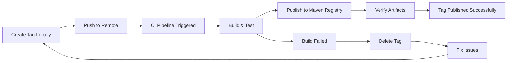
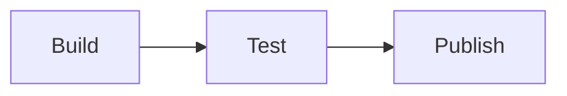
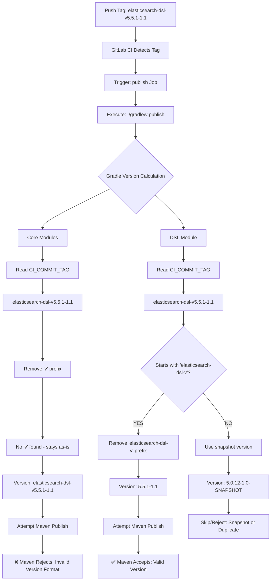

# Metalastic Publishing & Tag Management Guide

**Audience**: Maintainers and release managers
**Purpose**: Comprehensive guide for releasing Metalastic versions and managing Git tags

---

## Table of Contents

- [Overview](#overview)
- [Version Strategy](#version-strategy)
- [Tag Management](#tag-management)
- [Release Workflows](#release-workflows)
- [Step-by-Step Release Processes](#step-by-step-release-processes)
- [CI/CD Integration](#cicd-integration)
- [Version Configuration](#version-configuration)
- [Troubleshooting](#troubleshooting)
- [Best Practices](#best-practices)

---

## Overview

Metalastic uses a **dual publication strategy** to handle different versioning needs across its modules:

### Core Modules (Semantic Versioning)
- **Modules**: `core`, `processor`, `gradle-plugin`
- **Version Format**: Semantic versioning `{major}.{minor}.{patch}` (e.g., `2.0.5`)
- **Tag Format**: `v{major}.{minor}.{patch}` (e.g., `v2.0.5`)
- **Published Artifacts**:
  - `com.metalastic:core:2.0.5`
  - `com.metalastic:processor:2.0.5`
  - `com.metalastic:gradle-plugin:2.0.5`

### elasticsearch-dsl Module (Spring Data ES-Aligned Versioning)
- **Module**: `elasticsearch-dsl`
- **Version Format**: `{spring-data-es-version}-{dsl-version}` (e.g., `5.5.1-1.0`)
- **Tag Format**: `elasticsearch-dsl-v{spring-data-es-version}-{dsl-version}` (e.g., `elasticsearch-dsl-v5.5.1-1.0`)
- **Published Artifact**:
  - `com.metalastic:elasticsearch-dsl:5.5.1-1.0`

### Why Dual Versioning?

**Core Modules** follow semantic versioning because:
- ✅ Standard practice for libraries
- ✅ Clear compatibility signals (breaking changes, features, fixes)
- ✅ Easy to understand version progression

**elasticsearch-dsl Module** uses Spring Data ES-aligned versioning because:
- ✅ Version immediately shows Spring Data ES compatibility
- ✅ Users can quickly identify the right version for their Spring Data ES version
- ✅ DSL features can evolve independently of core modules
- ✅ Supports multiple Spring Data ES versions simultaneously

---

## Version Strategy

### Core Modules Version Numbers

Follow [Semantic Versioning 2.0.0](https://semver.org/):

```
{MAJOR}.{MINOR}.{PATCH}
```

**MAJOR version** (`X.0.0`):
- Breaking changes to public API
- Incompatible API changes
- Major architectural changes
- Example: `1.0.0` → `2.0.0`

**MINOR version** (`0.X.0`):
- New features (backward compatible)
- New functionality added
- Deprecations (but not removals)
- Example: `2.0.0` → `2.1.0`

**PATCH version** (`0.0.X`):
- Bug fixes (backward compatible)
- Performance improvements
- Documentation updates
- Example: `2.0.4` → `2.0.5`

### elasticsearch-dsl Module Version Numbers

```
{SPRING_DATA_ES_VERSION}-{DSL_VERSION}
```

**Spring Data ES Version** (first part):
- Matches the compatible Spring Data Elasticsearch version
- Example: `5.5.1` for Spring Data ES 5.5.1

**DSL Version** (second part):
- Independent versioning for DSL features
- Semantic versioning within the DSL module
- Example: `1.0` for first stable release, `1.1` for new features

**Examples**:
- `5.5.1-1.0` = Compatible with Spring Data ES 5.5.1, DSL version 1.0
- `5.5.1-1.1` = Compatible with Spring Data ES 5.5.1, DSL version 1.1 (new features)
- `5.6.0-1.0` = Compatible with Spring Data ES 5.6.0, DSL version 1.0

---

## Tag Management

### Core Modules Tags

**Format**: `v{major}.{minor}.{patch}`

**Examples**:
```bash
v2.0.4    # Core modules version 2.0.4
v2.0.5    # Core modules version 2.0.5
v2.1.0    # Core modules version 2.1.0
v3.0.0    # Core modules version 3.0.0
```

**Tag Validation**:
- Must start with `v`
- Must match semantic versioning pattern
- Regex: `^v?(0|[1-9]\d*)\.(0|[1-9]\d*)\.(0|[1-9]\d*)(?:-((?:0|[1-9]\d*|\d*[a-zA-Z-][0-9a-zA-Z-]*)(?:\.(?:0|[1-9]\d*|\d*[a-zA-Z-][0-9a-zA-Z-]*))*))?(?:\+([0-9a-zA-Z-]+(?:\.[0-9a-zA-Z-]+)*))?$`

**CI Trigger**: Any tag matching the semantic version pattern

**Affects**: core, processor, gradle-plugin (all three published with same version)

### elasticsearch-dsl Module Tags

**Format**: `elasticsearch-dsl-v{spring-data-es-version}-{dsl-version}`

**Examples**:
```bash
elasticsearch-dsl-v5.5.1-1.0    # Spring Data ES 5.5.1, DSL version 1.0
elasticsearch-dsl-v5.5.1-1.1    # Spring Data ES 5.5.1, DSL version 1.1
elasticsearch-dsl-v5.6.0-1.0    # Spring Data ES 5.6.0, DSL version 1.0
```

**Tag Validation**:
- Must start with `elasticsearch-dsl-v`
- Spring Data ES version and DSL version must follow semantic versioning
- No pre-release identifiers (stable releases only)

**CI Trigger**: Tags starting with `elasticsearch-dsl-v`

**Affects**: elasticsearch-dsl module only (independent of core modules)

### Tag Naming Rules

✅ **Valid Tags**:
```bash
v2.0.5                           # Core release
v2.1.0                           # Core minor release
elasticsearch-dsl-v5.5.1-1.0    # DSL release
elasticsearch-dsl-v5.6.0-1.0    # DSL with new Spring Data ES version
```

❌ **Invalid Tags**:
```bash
2.0.5                            # Missing 'v' prefix for core
v2.0.5-SNAPSHOT                  # No snapshot tags (use branches)
dsl-v5.5.1-1.0                   # Wrong prefix (must be elasticsearch-dsl-v)
elasticsearch-dsl-5.5.1-1.0      # Missing 'v' after prefix
```

### Tag Lifecycle



---

## Release Workflows

### Scenario 1: Core Modules Release

**Use Case**: New features, bug fixes, or breaking changes to core, processor, or gradle-plugin

**Affects**:
- ✅ `com.metalastic:core`
- ✅ `com.metalastic:processor`
- ✅ `com.metalastic:gradle-plugin`

**Does NOT affect**:
- ❌ `com.metalastic:elasticsearch-dsl` (independent versioning)

**Process**: [See Core Modules Release](#core-modules-release-checklist)

### Scenario 2: elasticsearch-dsl Module Release

**Use Case**: New DSL features, Spring Data ES compatibility updates, or bug fixes in DSL

**Affects**:
- ✅ `com.metalastic:elasticsearch-dsl`

**Does NOT affect**:
- ❌ `com.metalastic:core`
- ❌ `com.metalastic:processor`
- ❌ `com.metalastic:gradle-plugin`

**Process**: [See DSL Module Release](#dsl-module-release-checklist)

### Scenario 3: Coordinated Release (Core + DSL)

**Use Case**: Synchronized release when both core changes and DSL changes are ready

**Affects**: All modules

**Process**:
1. Follow [Core Modules Release](#core-modules-release-checklist) first
2. Then follow [DSL Module Release](#dsl-module-release-checklist)
3. Create combined release notes or reference both

**Example**:
```bash
# First, release core modules
git tag v2.1.0
git push origin v2.1.0

# Wait for pipeline to complete and verify

# Then, release DSL module
git tag elasticsearch-dsl-v5.5.1-1.1
git push origin elasticsearch-dsl-v5.5.1-1.1
```

### Scenario 4: Hotfix Release

**Use Case**: Critical bug fix that needs immediate release

**Process**:
1. Create hotfix branch from the tag that needs fixing
2. Apply fix and test thoroughly
3. Bump patch version
4. Create release notes (mark as hotfix)
5. Tag and push
6. Merge fix back to master

**Example**:
```bash
# Critical bug found in v2.0.4
git checkout v2.0.4
git checkout -b hotfix/v2.0.5
# Apply fix
git add .
git commit -m "fix: critical issue in field generation"
# Create release notes
git tag v2.0.5
git push origin v2.0.5
git push origin hotfix/v2.0.5

# After successful release, merge to master
git checkout master
git merge hotfix/v2.0.5
git push origin master
```

### Scenario 5: Snapshot Publishing (Feature Branches)

**Use Case**: Testing unreleased versions on feature branches

**Available Jobs**:
- `publish-manual` - Publishes all modules as snapshots
- `publish-elasticsearch-dsl` - Publishes only DSL module as snapshot

**Process**:
1. Push feature branch to GitLab
2. Wait for pipeline to run
3. In GitLab UI, manually trigger publish job
4. Artifacts published with snapshot version (e.g., `v2.0.4-7-g1a2b3c4-SNAPSHOT`)

**Snapshot Version Format**:
```bash
# Based on git describe
{last-tag}-{commits-since}-g{short-sha}-SNAPSHOT

# Example: 7 commits after v2.0.4
v2.0.4-7-g1a2b3c4-SNAPSHOT
```

**Note**: Snapshots are published to the same GitLab Maven Registry with `SNAPSHOT` suffix

---

## Step-by-Step Release Processes

### Core Modules Release Checklist

#### 1. **Pre-Release Preparation**

- [ ] Ensure `master` branch is stable and all tests pass
- [ ] All intended features/fixes are merged
- [ ] Local build succeeds: `./gradlew build`
- [ ] Determine version number following semantic versioning:
  - Patch (`X.Y.Z+1`): Bug fixes only
  - Minor (`X.Y+1.0`): New features (backward compatible)
  - Major (`X+1.0.0`): Breaking changes

**Example**: Releasing `v2.0.5` (patch release)

#### 2. **Create Release Notes**

- [ ] Create new file: `realease-notes/RELEASE_NOTES_v{version}.md`
- [ ] Document all changes since last release:
  - ✨ New features
  - 🐛 Bug fixes
  - ⚡ Performance improvements
  - 📝 Documentation updates
  - 💥 Breaking changes (if any)
- [ ] Include upgrade instructions if needed
- [ ] Add compatibility matrix if versions changed
- [ ] Include attribution footer:
  ```markdown
  🤖 Generated with [Claude Code](https://claude.com/claude-code)

  Co-Authored-By: Claude <noreply@anthropic.com>
  ```

**Template**: See [RELEASE_NOTES_v2.0.4.md](realease-notes/RELEASE_NOTES_v2.0.4.md) for reference

#### 3. **Commit Release Notes**

```bash
git add realease-notes/RELEASE_NOTES_v2.0.5.md
git commit -m "docs: add release notes for v2.0.5"
git push origin master
```

#### 4. **Create and Push Tag**

```bash
# Create annotated tag with release notes reference
git tag -a v2.0.5 -m "Release v2.0.5

See realease-notes/RELEASE_NOTES_v2.0.5.md for details."

# Push tag to trigger CI/CD
git push origin v2.0.5
```

**Important**: Use annotated tags (`-a`) to include metadata

#### 5. **Monitor CI/CD Pipeline**

- [ ] Go to GitLab: https://gitlab.ekino.com/iperia/metalastic/-/pipelines
- [ ] Find pipeline for tag `v2.0.5`
- [ ] Watch pipeline stages:
  - ✅ Build stage (compiles all modules)
  - ✅ Test stage (runs all tests)
  - ✅ Publish stage (publishes to Maven registry)

**Expected Duration**: ~3-5 minutes

#### 6. **Verify Pipeline Success**

Check pipeline logs for successful publication:
```
📦 Publishing version: 2.0.5
> Task :modules:core:publish
> Task :modules:processor:publish
> Task :modules:gradle-plugin:publish
BUILD SUCCESSFUL
```

#### 7. **Verify Published Artifacts**

- [ ] Check GitLab Package Registry: https://gitlab.ekino.com/iperia/metalastic/-/packages
- [ ] Verify all three artifacts are published:
  - `com.metalastic:core:2.0.5`
  - `com.metalastic:processor:2.0.5`
  - `com.metalastic:gradle-plugin:2.0.5`
- [ ] Download and inspect JARs (optional)
- [ ] Check Browse feature in GitLab UI to see uploaded artifacts

#### 8. **Test Published Artifacts**

Create a test project to verify artifacts are consumable:

```kotlin
// test-project/build.gradle.kts
plugins {
    kotlin("jvm") version "2.2.20"
    id("com.google.devtools.ksp") version "2.2.20-2.0.3"
    id("com.metalastic") version "2.0.5"  // Use new version
}

repositories {
    mavenCentral()
    maven {
        url = uri("https://gitlab.ekino.com/api/v4/projects/{PROJECT_ID}/packages/maven")
    }
}
```

```bash
cd test-project
./gradlew build
# Verify metamodels are generated
ls build/generated/ksp/main/kotlin/
```

#### 9. **Announce Release** (Optional)

- [ ] Post release announcement in team channels
- [ ] Update project README if needed
- [ ] Notify users of breaking changes (if major version)

#### 10. **Update Local Version** (Optional)

For continued development:

```kotlin
// gradle.properties
localVersion=2.0.6-SNAPSHOT  # Or next planned version
```

---

### DSL Module Release Checklist

#### 1. **Pre-Release Preparation**

- [ ] Ensure `master` branch is stable and all tests pass
- [ ] All intended DSL features/fixes are merged
- [ ] Local build succeeds: `./gradlew :modules:elasticsearch-dsl:build`
- [ ] Determine version numbers:
  - **Spring Data ES Version**: Check which Spring Data ES you're targeting
  - **DSL Version**: Follow semantic versioning for DSL features
    - Patch (`X.Y.Z+1`): Bug fixes in DSL
    - Minor (`X.Y+1.0`): New DSL features
    - Major (`X+1.0.0`): Breaking changes in DSL (rare)

**Example**: Releasing `elasticsearch-dsl-v5.5.1-1.1` (new DSL features)

#### 2. **Update Module Version Configuration**

Edit `modules/elasticsearch-dsl/build.gradle.kts`:

```kotlin
val springDataEsVersion = "5.5.1"  // Update if targeting new Spring Data ES
val dslVersion = "1.1"              // Update DSL version
```

**Commit this change**:
```bash
git add modules/elasticsearch-dsl/build.gradle.kts
git commit -m "chore(elasticsearch-dsl): bump version to 5.5.1-1.1"
git push origin master
```

#### 3. **Create Release Notes**

Option A: **Standalone Release Notes** (if releasing independently)
```bash
realease-notes/RELEASE_NOTES_elasticsearch-dsl-v5.5.1-1.1.md
```

Option B: **Include in Core Release Notes** (if coordinated release)
```bash
realease-notes/RELEASE_NOTES_v2.1.0.md
# Include DSL changes section
```

**Content should include**:
- DSL version and Spring Data ES compatibility
- New query types or features added
- Bug fixes in DSL
- Breaking changes in DSL API (if any)
- Updated usage examples

#### 4. **Commit Release Notes**

```bash
git add realease-notes/RELEASE_NOTES_elasticsearch-dsl-v5.5.1-1.1.md
git commit -m "docs: add release notes for elasticsearch-dsl v5.5.1-1.1"
git push origin master
```

#### 5. **Create and Push Tag**

```bash
# Create annotated tag
git tag -a elasticsearch-dsl-v5.5.1-1.1 -m "Release elasticsearch-dsl v5.5.1-1.1

Compatible with Spring Data Elasticsearch 5.5.1
DSL version 1.1 with new features

See realease-notes/RELEASE_NOTES_elasticsearch-dsl-v5.5.1-1.1.md for details."

# Push tag to trigger CI/CD
git push origin elasticsearch-dsl-v5.5.1-1.1
```

#### 6. **Monitor CI/CD Pipeline**

- [ ] Go to GitLab: https://gitlab.ekino.com/iperia/metalastic/-/pipelines
- [ ] Find pipeline for tag `elasticsearch-dsl-v5.5.1-1.1`
- [ ] Watch pipeline stages (same as core release)

**Expected Duration**: ~3-5 minutes

#### 7. **Verify Pipeline Success**

Check pipeline logs for DSL publication:
```
📦 Publishing elasticsearch-dsl version: 5.5.1-1.1
> Task :modules:elasticsearch-dsl:publish
BUILD SUCCESSFUL
```

#### 8. **Verify Published Artifacts**

- [ ] Check GitLab Package Registry: https://gitlab.ekino.com/iperia/metalastic/-/packages
- [ ] Verify DSL artifact is published:
  - `com.metalastic:elasticsearch-dsl:5.5.1-1.1`
- [ ] Check that core modules were NOT republished (independent versioning)

#### 9. **Test Published Artifact**

Create a test project to verify DSL is consumable:

```kotlin
// test-dsl-project/build.gradle.kts
dependencies {
    implementation("org.springframework.data:spring-data-elasticsearch:5.5.1")
    implementation("com.metalastic:core:2.0.5")
    ksp("com.metalastic:processor:2.0.5")
    implementation("com.metalastic:elasticsearch-dsl:5.5.1-1.1")  // Use new DSL version
}
```

```kotlin
// Test DSL features
import com.metalastic.elasticsearch.dsl.*

val builder = BoolQuery.Builder()
builder.boolQueryDsl {
    must + {
        document.field match "value"
    }
}
```

#### 10. **Update Local Version** (Optional)

For continued development:

```kotlin
// modules/elasticsearch-dsl/build.gradle.kts
val dslVersion = "1.2"  // Next planned version
```

---

## CI/CD Integration

### Pipeline Overview

Metalastic uses GitLab CI/CD with a Kotlin DSL-based configuration (`.gitlab-ci.main.kts`).

### Pipeline Stages



1. **Build**: Compiles all modules, generates artifacts
2. **Test**: Runs unit and integration tests
3. **Publish**: Publishes artifacts to GitLab Maven Registry

### Publish Jobs

#### 1. **Auto-Publish Job** (`publish`)

**Triggers**:
- ✅ Push to `master` branch
- ✅ Any Git tag push

**What it publishes**:
- All modules based on version detection
- For core tags (`v*`): core, processor, gradle-plugin
- For DSL tags (`elasticsearch-dsl-v*`): elasticsearch-dsl only

**Version calculation**:
```kotlin
val artifactVersion = when {
    tagName != null -> tagName.removePrefix("v")  // v2.0.5 -> 2.0.5
    else -> {
        // Use git describe for snapshots
        val gitDescribe = "git describe --tags --always --dirty --abbrev=7"
        // Example: v2.0.4-7-g1a2b3c4 -> 2.0.4-7-g1a2b3c4-SNAPSHOT
        "$version-SNAPSHOT"
    }
}
```

**Configuration**:
```yaml
publish ($artifactVersion):
  stage: publish
  script:
    - ./gradlew publish
  rules:
    - if: $CI_COMMIT_BRANCH == $CI_DEFAULT_BRANCH
    - if: $CI_COMMIT_TAG
```

#### 2. **Manual Publish Job** (`publish-manual`)

**Triggers**: Manual button click in GitLab UI

**Available on**:
- Merge request pipelines
- Feature branch pipelines

**What it publishes**: All modules as snapshots

**Use case**: Testing feature branch changes before merging

**Version format**: `{git-describe}-SNAPSHOT`

**Configuration**:
```yaml
publish-manual ($artifactVersion):
  stage: publish
  when: manual
  allow_failure: true
  script:
    - ./gradlew publish
  rules:
    - if: $CI_PIPELINE_SOURCE == "merge_request_event"
      when: manual
    - if: $CI_COMMIT_BRANCH != $CI_DEFAULT_BRANCH && $CI_COMMIT_TAG == null
      when: manual
```

#### 3. **Manual DSL Publish Job** (`publish-elasticsearch-dsl`)

**Triggers**: Manual button click in GitLab UI

**Available on**:
- Merge request pipelines
- Feature branch pipelines

**What it publishes**: elasticsearch-dsl module only

**Use case**: Testing DSL changes independently

**Configuration**:
```yaml
publish-elasticsearch-dsl:
  stage: publish
  when: manual
  allow_failure: true
  script:
    - ./gradlew :modules:elasticsearch-dsl:publish
  rules:
    - if: $CI_PIPELINE_SOURCE == "merge_request_event"
      when: manual
    - if: $CI_COMMIT_BRANCH != $CI_DEFAULT_BRANCH && $CI_COMMIT_TAG == null
      when: manual
```

### Version Detection Logic

The CI pipeline and Gradle build files work together to calculate versions:

**CI Environment** (`.gitlab-ci.main.kts`):
```kotlin
val artifactVersion = when {
    tagName != null -> tagName.removePrefix("v")
    else -> {
        val gitDescribe = "git describe --tags --always --dirty --abbrev=7".execute().trim()
        val version = gitDescribe.removePrefix("v")
        if (version.contains("-")) {
            "$version-SNAPSHOT"
        } else {
            "$version-SNAPSHOT"
        }
    }
}
```

**Gradle Build** (`build.gradle.kts`):
```kotlin
version = when {
    System.getenv("CI") != null -> {
        val tag = System.getenv("CI_COMMIT_TAG")
        tag?.removePrefix("v") ?: runCatching {
            // Use git describe
            val gitDescribe = providers.exec {
                commandLine("git", "describe", "--tags", "--always", "--dirty", "--abbrev=7")
            }.standardOutput.asText.get().trim()
            val version = gitDescribe.removePrefix("v")
            if (version.contains("-")) "$version-SNAPSHOT" else "$version-SNAPSHOT"
        }.getOrElse { "${System.getenv("CI_COMMIT_SHA").take(7)}-SNAPSHOT" }
    }
    else -> project.findProperty("localVersion") as String? ?: "2.0.1-SNAPSHOT"
}
```

**DSL Module** (`modules/elasticsearch-dsl/build.gradle.kts`):
```kotlin
version = when {
    System.getenv("CI") != null -> {
        val tag = System.getenv("CI_COMMIT_TAG")
        when {
            tag?.startsWith("elasticsearch-dsl-v") == true -> tag.removePrefix("elasticsearch-dsl-v")
            else -> {
                // Snapshot version
                "$springDataEsVersion-$dslVersion-SNAPSHOT"
            }
        }
    }
    else -> "$springDataEsVersion-$dslVersion-SNAPSHOT"
}
```

### Artifact Upload Paths

**Fixed in v2.0.4**: Artifact paths now correctly match multi-module structure

```yaml
artifacts:
  paths:
    - "modules/*/build/libs/*.jar"   # All module JARs
    - "modules/*/build/libs/*.pom"   # All module POMs
```

**Before v2.0.4** (incorrect):
```yaml
artifacts:
  paths:
    - "*/build/libs/"  # ❌ Didn't match modules/ directory
```

### How DSL Tags Automatically Trigger the Right Pipeline

This section explains the **magic** behind how a DSL-specific tag like `elasticsearch-dsl-v5.5.1-1.1` automatically publishes only the DSL module without any explicit routing logic in the CI pipeline.

#### The Question

When you create a tag like `git tag -a elasticsearch-dsl-v5.5.1-1.1`, how does the pipeline know to:
- ✅ Publish only `elasticsearch-dsl:5.5.1-1.1`
- ❌ NOT publish core, processor, or gradle-plugin modules

**The Answer**: It's a clever combination of:
1. **Universal CI trigger** - Any tag triggers the publish job
2. **Distributed version calculation** - Each module calculates its own version
3. **Smart pattern matching** - DSL module checks for its specific tag prefix
4. **Maven validation** - Registry rejects invalid versions naturally

#### Step-by-Step Flow

##### 1. CI Pipeline Trigger (`.gitlab-ci.main.kts:230`)

The pipeline trigger is **intentionally generic** - it triggers on ANY tag:

```kotlin
job("publish ($artifactVersion)") {
    stage(Stages.publish)

    script {
        +"$gradlewCmd publish"  // Runs ./gradlew publish for ALL modules
    }

    rules {
        rule {
            ifCondition = "\$CI_COMMIT_TAG"  // ← Triggers on ANY tag
        }
    }
}
```

**Key Point**: The CI pipeline doesn't distinguish between `v2.0.5` and `elasticsearch-dsl-v5.5.1-1.1`. It just runs `./gradlew publish` for any tag.

##### 2. Version Detection (Gradle Build Files)

When `./gradlew publish` runs, **each module independently** calculates its version:

**Core Modules** (`build.gradle.kts:10-34`):

```kotlin
allprojects {
    group = "com.metalastic"
    version = when {
        System.getenv("CI") != null -> {
            val tag = System.getenv("CI_COMMIT_TAG")
            tag?.removePrefix("v")  // Simply removes 'v' prefix
            ?: /* fallback to git describe */
        }
        else -> /* local development */
    }
}
```

**What happens with different tags**:

| Tag | Core Version Calculation | Result |
|-----|-------------------------|--------|
| `v2.0.5` | Remove `v` → `2.0.5` | ✅ Valid semantic version |
| `elasticsearch-dsl-v5.5.1-1.1` | Remove `v` → `elasticsearch-dsl-v5.5.1-1.1` | ❌ Invalid version (no `v` to remove!) |

**DSL Module** (`modules/elasticsearch-dsl/build.gradle.kts:11-48`):

```kotlin
// This OVERRIDES the allprojects version for elasticsearch-dsl module only
version = when {
    System.getenv("CI") != null -> {
        val tag = System.getenv("CI_COMMIT_TAG")
        when {
            // ← THIS IS THE MAGIC!
            tag?.startsWith("elasticsearch-dsl-v") == true ->
                tag.removePrefix("elasticsearch-dsl-v")  // Extract clean version
            else ->
                "$springDataEsVersion-$dslVersion-SNAPSHOT"  // Snapshot fallback
        }
    }
    else -> "$springDataEsVersion-$dslVersion-SNAPSHOT"
}
```

**What happens with different tags**:

| Tag | DSL Version Calculation | Result |
|-----|------------------------|--------|
| `v2.0.5` | Doesn't match prefix → fallback | `5.0.12-1.0-SNAPSHOT` |
| `elasticsearch-dsl-v5.5.1-1.1` | Matches prefix → remove it | ✅ `5.5.1-1.1` |

##### 3. Selective Publishing (Maven Validation)

The `./gradlew publish` command attempts to publish **ALL modules**, but Maven registry validates versions:

**With `elasticsearch-dsl-v5.5.1-1.1` tag**:

```
Attempting to publish:
├─ core:elasticsearch-dsl-v5.5.1-1.1       ❌ REJECTED (invalid semantic version)
├─ processor:elasticsearch-dsl-v5.5.1-1.1  ❌ REJECTED (invalid semantic version)
├─ gradle-plugin:elasticsearch-dsl-v5.5.1-1.1  ❌ REJECTED (invalid semantic version)
└─ elasticsearch-dsl:5.5.1-1.1             ✅ PUBLISHED (valid Spring Data ES format)
```

**With `v2.0.5` tag**:

```
Attempting to publish:
├─ core:2.0.5                    ✅ PUBLISHED (valid semantic version)
├─ processor:2.0.5               ✅ PUBLISHED (valid semantic version)
├─ gradle-plugin:2.0.5           ✅ PUBLISHED (valid semantic version)
└─ elasticsearch-dsl:5.0.12-1.0-SNAPSHOT  ❌ SKIPPED (snapshot or duplicate)
```

#### Complete Flow Diagram



#### Key Design Patterns

##### 1. Version Override Pattern

The DSL module **overrides** the project-wide version:

```kotlin
// Root build.gradle.kts sets version for ALL projects
allprojects {
    version = "calculated-from-tag"
}

// DSL module OVERRIDES for itself only
// modules/elasticsearch-dsl/build.gradle.kts
version = when { /* DSL-specific logic */ }
```

This allows DSL to have completely independent versioning logic.

##### 2. Prefix Detection Pattern

```kotlin
tag?.startsWith("elasticsearch-dsl-v") == true
```

This pattern ensures:
- ✅ Only DSL-specific tags trigger DSL version extraction
- ✅ Core tags don't accidentally trigger DSL publishing
- ✅ No complex routing logic needed in CI

##### 3. Graceful Failure Pattern

Invalid versions are **rejected naturally** by Maven registry, not by explicit checks:
- No need to filter which modules publish in CI
- No need to check tag patterns in CI
- Maven registry acts as the validation layer

#### Testing the Flow Locally

You can simulate this behavior locally to verify:

```bash
# Simulate core tag
CI=true CI_COMMIT_TAG=v2.0.5 ./gradlew properties | grep "^version:"
# Output:
# version: 2.0.5                           (core modules)
# version: 5.0.12-1.0-SNAPSHOT            (elasticsearch-dsl)

# Simulate DSL tag
CI=true CI_COMMIT_TAG=elasticsearch-dsl-v5.5.1-1.1 ./gradlew properties | grep "^version:"
# Output:
# version: elasticsearch-dsl-v5.5.1-1.1   (core modules - invalid!)
# version: 5.5.1-1.1                      (elasticsearch-dsl - valid!)

# Check specific module version
CI=true CI_COMMIT_TAG=elasticsearch-dsl-v5.5.1-1.1 \
  ./gradlew :modules:elasticsearch-dsl:properties | grep "^version:"
# Output: version: 5.5.1-1.1
```

#### Why This Design is Clever

**Advantages**:
1. ✅ **Declarative** - No imperative routing logic
2. ✅ **Distributed** - Each module knows how to version itself
3. ✅ **Maintainable** - Logic is in module build files, not CI
4. ✅ **Type-safe** - Gradle's Kotlin DSL provides compile-time validation
5. ✅ **Fail-safe** - Invalid versions rejected by Maven, not missed in CI
6. ✅ **Extensible** - Easy to add more versioning strategies per module

**Trade-offs**:
1. ⚠️ **Implicit behavior** - Not obvious from CI configuration alone
2. ⚠️ **Requires understanding** - Need to know Gradle runs for all modules
3. ⚠️ **Rejection logs** - CI logs show "failed" publishes (but these are expected)

#### Implementation Files Reference

| File | Lines | Purpose |
|------|-------|---------|
| `.gitlab-ci.main.kts` | 218-246 | Universal publish job trigger |
| `build.gradle.kts` | 10-34 | Core modules version calculation |
| `modules/elasticsearch-dsl/build.gradle.kts` | 11-48 | DSL version override with prefix detection |

#### Common Questions

**Q: Why not filter in CI which modules to publish?**
A: This would require duplicating version logic in both CI and Gradle. Current approach keeps versioning logic in one place (Gradle).

**Q: What if I create a tag like `elasticsearch-dsl-v2.0.5` by mistake?**
A: DSL would publish as `2.0.5`, which would be accepted by Maven but might confuse users. Always use the correct format!

**Q: Can I test DSL publishing without creating a tag?**
A: Yes! Use the manual `publish-elasticsearch-dsl` job in GitLab UI on feature branches.

**Q: Why do CI logs show "failed" publishes for core modules with DSL tags?**
A: This is expected behavior. Maven rejects invalid versions, but the build continues and DSL publishes successfully.

---

## Version Configuration

### Core Modules Version Sources

#### 1. **CI Environment**

**Source**: Git tags or `git describe` output
**Priority**: Highest (overrides everything in CI)

```bash
# Tag-based (release)
CI_COMMIT_TAG=v2.0.5 → version=2.0.5

# Describe-based (snapshot)
git describe → v2.0.4-7-g1a2b3c4 → version=2.0.4-7-g1a2b3c4-SNAPSHOT
```

**Configuration**: Automatic in CI, no manual changes needed

#### 2. **Local Development**

**Source**: `gradle.properties`
**Priority**: Used only when NOT in CI environment

```properties
# gradle.properties
localVersion=local-SNAPSHOT
```

**Usage**:
```bash
# Uses localVersion from gradle.properties
./gradlew build

# Override on command line
./gradlew build -PlocalVersion=2.0.6-dev
```

**When to update**: After releasing a version, optionally update to next planned version

### elasticsearch-dsl Module Version Sources

#### 1. **Module Build Configuration**

**Source**: `modules/elasticsearch-dsl/build.gradle.kts`
**Priority**: Always used (defines Spring Data ES version)

```kotlin
val springDataEsVersion = "5.5.1"  // ← Update this for new Spring Data ES compatibility
val dslVersion = "1.0"              // ← Update this for DSL feature changes
```

**When to update**:
- Change `springDataEsVersion`: When adding support for new Spring Data ES version
- Change `dslVersion`: When releasing new DSL features or fixes

**Examples**:
```kotlin
// Adding support for Spring Data ES 5.6.0
val springDataEsVersion = "5.6.0"  // Changed
val dslVersion = "1.0"              // Keep same (port existing features)

// New DSL features on same Spring Data ES version
val springDataEsVersion = "5.5.1"  // Keep same
val dslVersion = "1.1"              // Increment for new features

// Bug fix in DSL
val springDataEsVersion = "5.5.1"  // Keep same
val dslVersion = "1.0.1"            // Patch version for bug fix
```

#### 2. **Local Development Override** (Optional)

**Source**: `gradle.properties`

```properties
# gradle.properties
elasticsearch.dsl.version=1.1-dev
```

**Usage**: Override DSL version without editing build file

### Spring Data ES Dependency

When updating Spring Data ES compatibility:

**1. Update dependency version**:

```kotlin
// modules/elasticsearch-dsl/build.gradle.kts
dependencies {
    // Update this version
    api("org.springframework.data:spring-data-elasticsearch:5.6.0")

    // May need to update elasticsearch-java version to match
    implementation("co.elastic.clients:elasticsearch-java:8.6.0")
}
```

**2. Check compatibility matrix**:
- Verify Spring Data ES and Elasticsearch client versions match
- Test with target Elasticsearch server version
- Update README compatibility matrix

**3. Test thoroughly**:
```bash
./gradlew :modules:elasticsearch-dsl:test
```

---

## Troubleshooting

### Failed Pipeline

#### Problem: Build stage fails

**Symptoms**:
- Compilation errors in pipeline
- Tests pass locally but fail in CI

**Solutions**:
1. **Check Java version**: CI uses Java 21, ensure compatibility
   ```bash
   ./gradlew build -Dorg.gradle.java.home=/path/to/java21
   ```

2. **Clean build locally**:
   ```bash
   ./gradlew clean build
   ```

3. **Check for environment-specific issues**:
   - File paths (case sensitivity)
   - Line endings (CRLF vs LF)
   - Gradle wrapper version

4. **Review pipeline logs**: Click on failed job in GitLab UI

#### Problem: Test stage fails

**Symptoms**:
- Unit tests fail in CI
- Integration tests timeout

**Solutions**:
1. **Run tests locally with same settings**:
   ```bash
   ./gradlew test --info
   ```

2. **Check test resources**:
   - Ensure test resources are committed
   - Verify test data integrity

3. **Check for timing issues**:
   - Increase test timeouts if needed
   - Check for race conditions

#### Problem: Publish stage fails

**Symptoms**:
- "401 Unauthorized" errors
- "Unable to publish" messages

**Solutions**:
1. **Verify CI/CD variables**:
   - `CI_JOB_TOKEN` should be automatically provided by GitLab
   - Check GitLab → Settings → CI/CD → Variables

2. **Check project permissions**:
   - CI/CD must have permission to write to Package Registry
   - Settings → General → Visibility, project features, permissions

3. **Verify Maven registry settings**:
   ```bash
   # Check if artifacts are reaching Maven registry
   curl -H "Private-Token: $TOKEN" \
     "https://gitlab.ekino.com/api/v4/projects/$PROJECT_ID/packages"
   ```

### Tag Mistakes

#### Problem: Created wrong tag

**Example**: Tagged as `v2.0.5` but meant `v2.1.0`

**Solution**: Delete and recreate

```bash
# Delete local tag
git tag -d v2.0.5

# Delete remote tag
git push origin :refs/tags/v2.0.5

# Create correct tag
git tag -a v2.1.0 -m "Release v2.1.0"
git push origin v2.1.0
```

⚠️ **Warning**: Only delete tags that haven't been published yet. If artifacts are already published, consider creating a new version instead.

#### Problem: Tag pushed but pipeline not triggered

**Symptoms**:
- Tag exists on GitLab
- No pipeline appears for the tag

**Solutions**:
1. **Check tag format**:
   ```bash
   # Verify tag matches expected pattern
   git tag -l 'v*'                           # Core tags
   git tag -l 'elasticsearch-dsl-v*'        # DSL tags
   ```

2. **Manually trigger pipeline**:
   - Go to GitLab → CI/CD → Pipelines
   - Click "Run Pipeline"
   - Select the tag from dropdown

3. **Check CI/CD configuration**:
   - Ensure `.gitlab-ci.main.kts` is committed and valid
   - Check workflow rules

#### Problem: Multiple tags on same commit

**Example**: Accidentally tagged same commit twice

```bash
v2.0.5
v2.0.5-fixed
```

**Solution**:
1. Delete incorrect tag (follow "Delete tag" steps above)
2. Keep only the correct semantic version tag
3. If already published, leave both (won't hurt, just confusing)

### Version Conflicts

#### Problem: Published version already exists

**Symptoms**:
- Maven publish fails with "409 Conflict"
- Artifact already exists in registry

**Why this happens**:
- Tag was already published
- Trying to republish same version

**Solutions**:

**Option 1: Increment version** (recommended)
```bash
# Delete problematic tag
git tag -d v2.0.5
git push origin :refs/tags/v2.0.5

# Create new tag with incremented version
git tag -a v2.0.6 -m "Release v2.0.6"
git push origin v2.0.6
```

**Option 2: Delete published artifact** (use with caution)
1. Go to GitLab → Packages & Registries → Package Registry
2. Find the conflicting version
3. Click "Delete" (requires maintainer permissions)
4. Re-push tag to republish

⚠️ **Warning**: Only delete published artifacts if they were never used by consumers.

#### Problem: DSL version doesn't match code

**Symptoms**:
- Published DSL has wrong version number
- Artifact version doesn't match tag

**Cause**: Forgot to update `modules/elasticsearch-dsl/build.gradle.kts` before tagging

**Solution**:
1. Delete the incorrect tag:
   ```bash
   git tag -d elasticsearch-dsl-v5.5.1-1.1
   git push origin :refs/tags/elasticsearch-dsl-v5.5.1-1.1
   ```

2. Update build configuration:
   ```kotlin
   // modules/elasticsearch-dsl/build.gradle.kts
   val springDataEsVersion = "5.5.1"
   val dslVersion = "1.1"  // Fix this
   ```

3. Commit and create new tag:
   ```bash
   git add modules/elasticsearch-dsl/build.gradle.kts
   git commit -m "fix(elasticsearch-dsl): correct version to 1.1"
   git push origin master

   git tag -a elasticsearch-dsl-v5.5.1-1.1 -m "Release elasticsearch-dsl v5.5.1-1.1"
   git push origin elasticsearch-dsl-v5.5.1-1.1
   ```

### Rollback Procedures

#### Scenario: Need to rollback to previous version

**Why**: Critical bug discovered after release

**Options**:

**Option 1: Hotfix Release** (recommended)
1. Create hotfix branch from previous working tag
2. Apply fix
3. Release new patch version
4. Deprecate buggy version in release notes

Example:
```bash
git checkout v2.0.5  # Known good version
git checkout -b hotfix/v2.0.6
# Apply fix
git tag v2.0.6
git push origin v2.0.6
```

**Option 2: Yank Published Version**
1. Delete published artifacts from Maven registry
2. Announce the version should not be used
3. Release fixed version immediately

⚠️ **Warning**: This can break builds for consumers who already use the version

**Option 3: Deprecation Notice**
1. Leave published version as-is
2. Release new fixed version
3. Add prominent warning to release notes
4. Update README with version warning

### Getting Help

**Pipeline Issues**:
1. Check GitLab pipeline logs
2. Enable Gradle debug output: `./gradlew build --debug`
3. Check CI/CD documentation: https://docs.gitlab.com/ee/ci/

**Version Questions**:
1. Review this document
2. Check existing tags: `git tag -l`
3. Review published packages: https://gitlab.ekino.com/iperia/metalastic/-/packages

**GitLab Issues**:
- Report at: https://gitlab.ekino.com/iperia/metalastic/issues

---

## Best Practices

### Release Cadence

**Core Modules**:
- **Patch releases**: As needed for bug fixes (no schedule)
- **Minor releases**: Every 2-4 weeks when features are ready
- **Major releases**: Rarely, with advance notice (breaking changes)

**elasticsearch-dsl Module**:
- **DSL patches**: As needed for bug fixes
- **DSL minor**: Every 1-2 months when new features are ready
- **Spring Data ES updates**: When new Spring Data ES versions are released

### Version Bumping Rules

**When to bump MAJOR** (breaking changes):
- ❌ Removing public APIs
- ❌ Changing method signatures
- ❌ Renaming classes or packages
- ❌ Incompatible behavior changes

**When to bump MINOR** (new features):
- ✅ Adding new public APIs
- ✅ New features (backward compatible)
- ✅ Deprecating APIs (not removing)
- ✅ Performance improvements

**When to bump PATCH** (bug fixes):
- ✅ Bug fixes
- ✅ Documentation improvements
- ✅ Internal refactoring
- ✅ Test improvements

### Testing Before Release

**Always test locally**:
```bash
# Clean build
./gradlew clean build

# Run all tests
./gradlew test

# Check code formatting
./gradlew spotlessCheck

# Run static analysis
./gradlew detekt

# Publish to local Maven
./gradlew publishToMavenLocal

# Test in consumer project
cd ~/test-project
./gradlew clean build
```

**Verify metamodel generation**:
```bash
# Check generated files
ls build/generated/ksp/main/kotlin/

# Verify no compilation errors
./gradlew build -x test
```

**For DSL releases**:
```bash
# Test DSL module specifically
./gradlew :modules:elasticsearch-dsl:test

# Verify query building works
# (run integration tests with real queries)
```

### Communication Guidelines

**Before Major Release**:
- [ ] Announce upcoming breaking changes
- [ ] Provide migration guide in advance
- [ ] Give users 2+ weeks notice
- [ ] Consider deprecation period

**Release Announcement Template**:
```markdown
## Metalastic v2.1.0 Released 🎉

**What's New**:
- New feature X for better performance
- Bug fix Y that affected nested queries
- Documentation improvements

**Breaking Changes**: None (backward compatible)

**Upgrade Instructions**:
```kotlin
dependencies {
    implementation("com.metalastic:core:2.1.0")
    ksp("com.metalastic:processor:2.1.0")
}
```

**Full Release Notes**: https://gitlab.ekino.com/iperia/metalastic/-/blob/master/realease-notes/RELEASE_NOTES_v2.1.0.md
```

### Semantic Versioning Compliance

Follow [Semantic Versioning 2.0.0](https://semver.org/) strictly:

```
MAJOR.MINOR.PATCH

MAJOR: Incompatible API changes
MINOR: Backward-compatible functionality added
PATCH: Backward-compatible bug fixes
```

**Pre-release versions** (if needed):
```
2.1.0-alpha.1
2.1.0-beta.1
2.1.0-rc.1
```

### Documentation Updates

**Always update**:
- [ ] Release notes (required)
- [ ] README compatibility matrix (if versions changed)
- [ ] Migration guides (if breaking changes)
- [ ] CHANGELOG.md (if exists)

**Consider updating**:
- [ ] Code examples with new version numbers
- [ ] Screenshots or diagrams
- [ ] Troubleshooting sections

### Release Verification Checklist

Before announcing a release:

- [ ] All CI/CD pipeline jobs passed
- [ ] Artifacts visible in GitLab Package Registry
- [ ] Test project can consume new version
- [ ] Metamodels generate correctly in test project
- [ ] No errors in pipeline logs
- [ ] Release notes are complete and accurate
- [ ] Tag is annotated and pushed
- [ ] Version numbers match across all artifacts

### Versioning Edge Cases

**Scenario**: Multiple minor features ready at different times

**Solution**: Batch features into planned minor releases instead of releasing many minor versions quickly.

**Example**:
- ❌ v2.1.0 (feature A), v2.2.0 (feature B), v2.3.0 (feature C) in same week
- ✅ v2.1.0 (features A, B, C together) after all are ready

**Scenario**: Critical bug fix needed during minor release development

**Solution**: Create patch release from previous stable version, then merge fix to development branch.

**Example**:
```bash
# Bug in v2.0.5, currently developing v2.1.0
git checkout v2.0.5
git checkout -b hotfix/v2.0.6
# Fix bug
git tag v2.0.6
git push origin v2.0.6

# Merge fix to master (where v2.1.0 is being developed)
git checkout master
git merge hotfix/v2.0.6
```

---

## Quick Reference

### Common Commands

```bash
# List all tags
git tag -l

# List core module tags only
git tag -l 'v*'

# List DSL module tags only
git tag -l 'elasticsearch-dsl-v*'

# Create annotated tag (core)
git tag -a v2.0.5 -m "Release v2.0.5"

# Create annotated tag (DSL)
git tag -a elasticsearch-dsl-v5.5.1-1.0 -m "Release elasticsearch-dsl v5.5.1-1.0"

# Push specific tag
git push origin v2.0.5

# Push all tags (use with caution)
git push --tags

# Delete local tag
git tag -d v2.0.5

# Delete remote tag
git push origin :refs/tags/v2.0.5

# View tag details
git show v2.0.5

# Check current version (CI logic)
git describe --tags --always --dirty --abbrev=7

# Test build locally
./gradlew build

# Publish to local Maven
./gradlew publishToMavenLocal

# Build specific module
./gradlew :modules:elasticsearch-dsl:build

# Show module version
./gradlew :modules:elasticsearch-dsl:showVersion
```

### URL Quick Reference

- **GitLab Project**: https://gitlab.ekino.com/iperia/metalastic
- **Pipelines**: https://gitlab.ekino.com/iperia/metalastic/-/pipelines
- **Package Registry**: https://gitlab.ekino.com/iperia/metalastic/-/packages
- **Tags**: https://gitlab.ekino.com/iperia/metalastic/-/tags
- **Merge Requests**: https://gitlab.ekino.com/iperia/metalastic/-/merge_requests
- **CI/CD Settings**: https://gitlab.ekino.com/iperia/metalastic/-/settings/ci_cd

### Version Format Reference

| Type | Format | Example | Tag Example |
|------|--------|---------|-------------|
| Core Release | `{major}.{minor}.{patch}` | `2.0.5` | `v2.0.5` |
| Core Snapshot | `{describe}-SNAPSHOT` | `2.0.4-7-g1a2b3c4-SNAPSHOT` | N/A |
| DSL Release | `{spring-data-es}-{dsl}` | `5.5.1-1.0` | `elasticsearch-dsl-v5.5.1-1.0` |
| DSL Snapshot | `{spring-data-es}-{dsl}-SNAPSHOT` | `5.5.1-1.0-SNAPSHOT` | N/A |
| Local Dev | `local-SNAPSHOT` | `local-SNAPSHOT` | N/A |

---

**Document Version**: 1.0
**Last Updated**: October 2025
**Maintainer**: Metalastic Team

🤖 Generated with [Claude Code](https://claude.com/claude-code)

Co-Authored-By: Claude <noreply@anthropic.com>
