# QElasticsearch Annotation Processor Architecture

This document provides a comprehensive overview of the QElasticsearch annotation processor module, which generates type-safe DSL classes from Spring Data Elasticsearch `@Document` annotated classes at compile time.

## Overview

The processor is built on **Kotlin Symbol Processing (KSP)** and uses **KotlinPoet** for code generation. It transforms existing Spring Data Elasticsearch domain classes into type-safe query DSL objects automatically.

## Module Structure

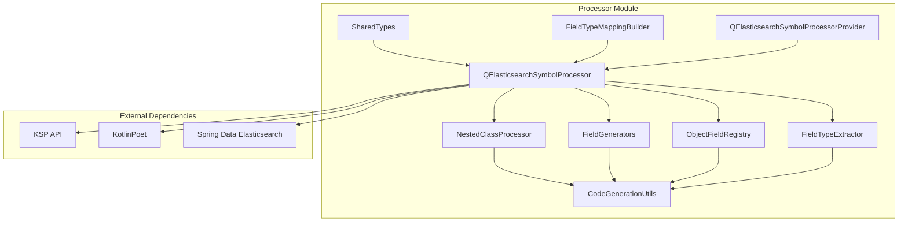

## Core Components

### 1. QElasticsearchSymbolProcessor
**Main orchestrator** that coordinates the entire code generation process.

**Key Responsibilities:**
- Discovers `@Document` annotated classes
- Orchestrates object field collection
- Generates Q-classes for documents and nested objects
- Manages file output and deduplication

### 2. NestedClassProcessor
**Dependency analyzer** that recursively discovers all object fields that need Q-class generation.

**Key Responsibilities:**
- Collects nested classes within document classes
- Processes properties to find referenced object types
- Maintains global registry of object fields
- Handles recursive object field discovery

### 3. FieldGenerators
**Field property generator** that creates type-safe field definitions for Q-classes.

**Key Responsibilities:**
- Generates simple field properties (text, keyword, numeric, etc.)
- Handles multi-field properties with inner fields
- Creates object and nested field properties
- Manages KDoc documentation generation

### 4. ObjectFieldRegistry
**Object field manager** that handles generation of object field properties and their type resolution.

**Key Responsibilities:**
- Generates object and nested field properties
- Resolves object field types and classes
- Determines proper delegation calls (objectField vs nestedField)

### 5. FieldTypeExtractor
**Type analyzer** that determines Elasticsearch field types and validates object references.

**Key Responsibilities:**
- Extracts field types from `@Field` annotations
- Identifies object and nested field types
- Validates collection element types
- Handles complex type analysis

## Processing Flow

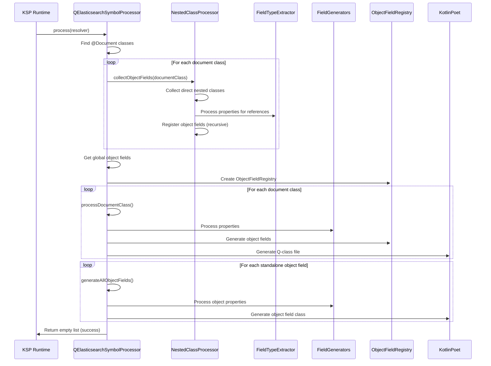

## Data Flow Architecture

```mermaid
graph TD
    subgraph "Input Phase"
        A[Spring Data Classes] --> B[@Document Classes]
        B --> C[KSP Resolver]
    end
    
    subgraph "Analysis Phase"
        C --> D[Document Discovery]
        D --> E[Object Field Collection]
        E --> F[Type Analysis]
        F --> G[Dependency Resolution]
    end
    
    subgraph "Generation Phase"  
        G --> H[Field Type Mapping]
        H --> I[Property Generation]
        I --> J[Class Construction]
        J --> K[File Generation]
    end
    
    subgraph "Output Phase"
        K --> L[Q-Document Classes]
        K --> M[Q-Object Field Classes]
        L --> N[Generated Kotlin Files]
        M --> N
    end
    
    style A fill:#e1f5fe
    style N fill:#c8e6c9
```

## Key Data Structures

### ImportContext
Manages import statements and delegation functions during code generation:

```kotlin
data class ImportContext(
  val usedImports: MutableSet<String> = mutableSetOf(),
  val usedDelegationFunctions: MutableSet<String> = mutableSetOf(),
)
```

### ProcessedFieldType
Represents analyzed field type information:

```kotlin
data class ProcessedFieldType(
  val elasticsearchType: FieldType,      // Elasticsearch field type
  val kotlinType: KSTypeReference,       // Kotlin type reference
  val kotlinTypeName: String,            // Simple type name
  val isObjectType: Boolean,             // Whether it needs object field handling
)
```

### ObjectFieldInfo
Contains metadata about object fields that need Q-class generation:

```kotlin
data class ObjectFieldInfo(
  val className: String,                 // Generated Q-class name
  val packageName: String,               // Package for generated class
  val classDeclaration: KSClassDeclaration, // Original class declaration
  val qualifiedName: String,             // Fully qualified original class name
  val parentDocumentClass: KSClassDeclaration? = null, // Parent document if any
)
```

## Object Field Collection Strategy

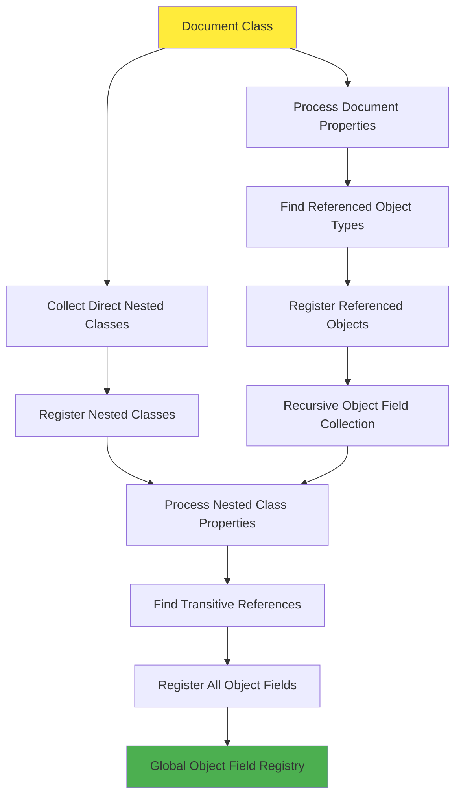

**Strategy Benefits:**
- ✅ **Targeted Processing** - Only processes classes actually referenced by documents
- ✅ **Recursive Discovery** - Finds deep nested object references
- ✅ **Deduplication** - Prevents generating duplicate classes
- ✅ **Efficient** - No full classpath scanning required

## Field Type Mapping System

```mermaid
graph LR
    subgraph "Elasticsearch Types"
        A[Text] --> B["TextField&lt;String&gt;"]
        C[Keyword] --> D["KeywordField&lt;String&gt;"]
        E[Long] --> F["LongField&lt;Long&gt;"]
        G[Boolean] --> H["BooleanField&lt;Boolean&gt;"]
        I[Object] --> J[ObjectField]
        K[Nested] --> L[NestedField]
    end
    
    subgraph "Multi-Field Handling"
        M[@MultiField] --> N[CustomMultiField]
        N --> O[MainField + InnerFields]
    end
    
    subgraph "Generated DSL"
        B --> P["by text&lt;String&gt;()"]
        D --> Q["by keyword&lt;String&gt;()"]
        F --> R["by long&lt;Long&gt;()"]
        H --> S["by boolean&lt;Boolean&gt;()"]
        J --> T["by objectField&lt;T&gt;()"]
        L --> U["by nestedField&lt;T&gt;()"]
        O --> V["by multiField&lt;T&gt;()"]
    end
    
    style A fill:#e3f2fd
    style P fill:#c8e6c9
```

## Code Generation Process

### 1. Document Class Generation

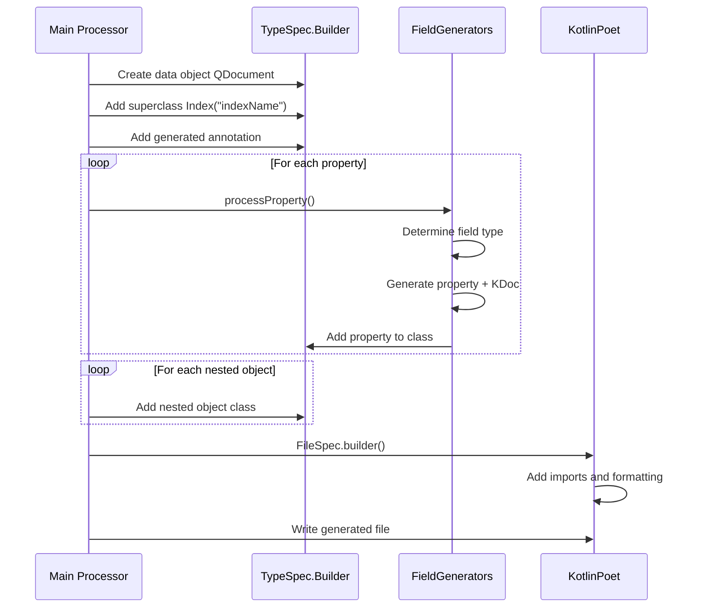

### 2. Object Field Class Generation

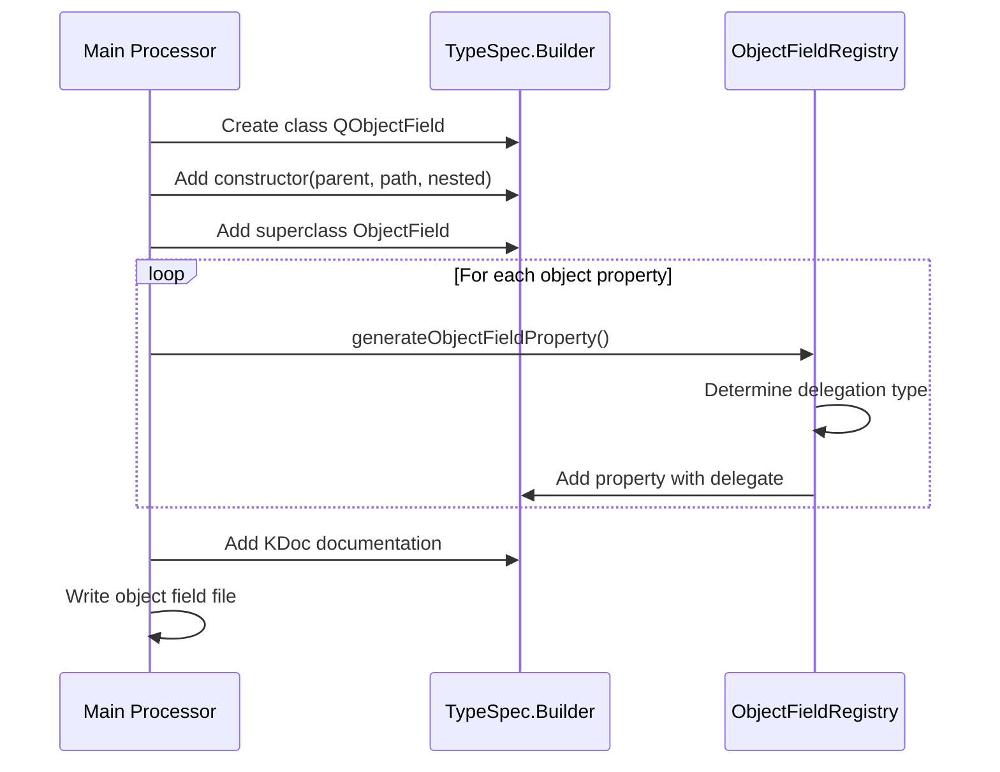

## Import Management System

The QElasticsearch processor uses a streamlined **two-tier import management system** to ensure generated files have only the necessary imports while maintaining clean, readable code. **KotlinPoet automatically handles all type imports**, eliminating the need for manual type import tracking.

### Import Management Architecture

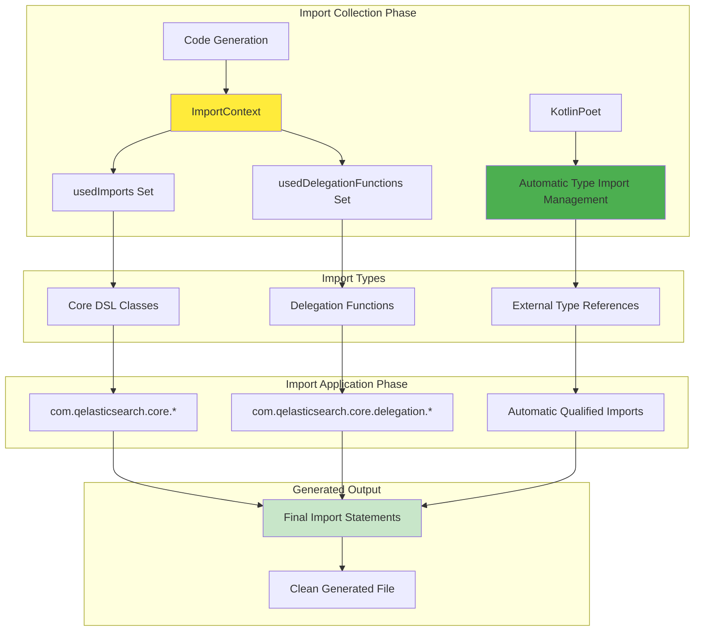

### Two-Tier Import System + KotlinPoet Automatic Management

**1. Core DSL Imports (`usedImports`)**
```kotlin
// Collected during field generation
importContext.usedImports.add("TextField")
importContext.usedImports.add("KeywordField")
importContext.usedImports.add("ObjectField")

// Results in generated imports:
import com.qelasticsearch.core.TextField
import com.qelasticsearch.core.KeywordField  
import com.qelasticsearch.core.ObjectField
```

**2. Delegation Function Imports (`usedDelegationFunctions`)**
```kotlin
// Collected during property generation
importContext.usedDelegationFunctions.add("text")
importContext.usedDelegationFunctions.add("multiField")
importContext.usedDelegationFunctions.add("objectField")

// Results in generated imports:
import com.qelasticsearch.core.delegation.text
import com.qelasticsearch.core.delegation.multiField
import com.qelasticsearch.core.delegation.objectField
```

**3. External Type Imports (Automatic via KotlinPoet)**
```kotlin
// KotlinPoet automatically handles external type imports:
// - External domain classes (com.example.domain.User)
// - Standard annotations (jakarta.annotation.Generated)
// - Generic type arguments (ParametrizedType<String>)
// - Collections (MutableList<String>, MutableMap<String, Int>)

// Results in automatically generated imports:
import com.example.domain.User
import jakarta.annotation.Generated
import kotlin.collections.MutableList
```

### Import Collection Flow

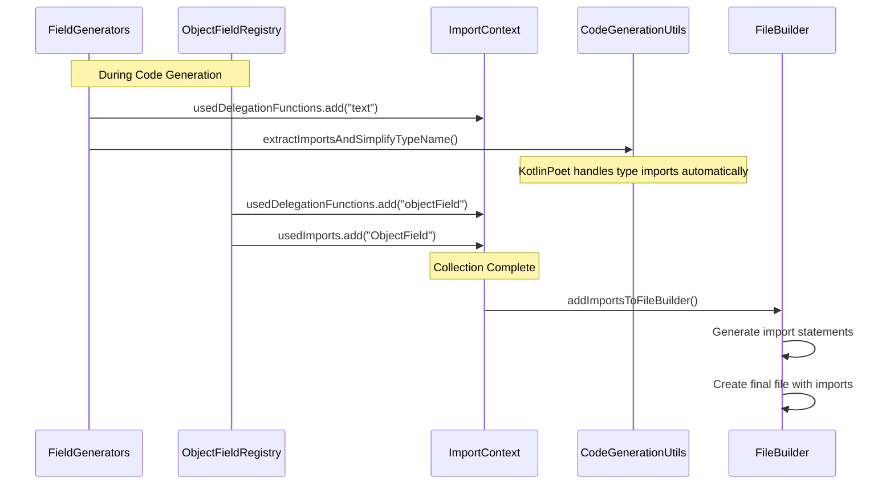

### Smart Type Name Processing

The processor intelligently processes type names while collecting necessary imports:

```kotlin
fun extractImportsAndSimplifyTypeName(typeName: TypeName, usedImports: MutableSet<String>): String =
  when (typeName) {
    is ClassName -> {
      // Only import non-standard library types
      if (
        typeName.packageName.isNotEmpty() &&
          !typeName.packageName.startsWith("kotlin") &&
          !typeName.packageName.startsWith("java.lang")
      ) {
        usedImports.add("${typeName.packageName}.${typeName.simpleName}")
      }
      typeName.simpleName  // Return simple name for code generation
    }
    
    is ParameterizedTypeName -> {
      // Recursively process generic types
      val baseSimpleName = extractImportsAndSimplifyTypeName(typeName.rawType, usedImports)
      val typeArgs = typeName.typeArguments.joinToString(", ") { arg ->
        extractImportsAndSimplifyTypeName(arg, usedImports)
      }
      "$baseSimpleName&lt;$typeArgs&gt;"
    }
    
    else -> typeName.toString()
  }
```

### Import Application Implementation

```kotlin
private fun addImportsToFileBuilder(fileBuilder: FileSpec.Builder, importContext: ImportContext) {
  // 1. Add Core DSL imports (TextField, KeywordField, etc.)
  importContext.usedImports.forEach { className ->
    fileBuilder.addImport(CoreConstants.CORE_PACKAGE, className)
  }

  // 2. Add delegation function imports (text, keyword, objectField, etc.)
  importContext.usedDelegationFunctions.forEach { delegationFunction ->
    fileBuilder.addImport("${CoreConstants.CORE_PACKAGE}.delegation", delegationFunction)
  }

  // 3. External type imports are handled automatically by KotlinPoet
  // No manual import management needed for:
  // - External domain classes (com.example.User)
  // - Generic type arguments (ParametrizedType<String>)
  // - Standard library types (MutableList, MutableMap)
  // - Jakarta annotations (@Generated)
}
```

### Generated Import Examples

**Simple Document:**
```kotlin
// Generated imports for basic document
import com.qelasticsearch.core.Index
import com.qelasticsearch.core.KeywordField
import com.qelasticsearch.core.TextField
import com.qelasticsearch.core.delegation.keyword
import com.qelasticsearch.core.delegation.text
import jakarta.annotation.Generated
import kotlin.String
import kotlin.jvm.JvmName
```

**Complex Document with Nested Objects:**
```kotlin
// Generated imports for complex document
import com.qelasticsearch.core.Index
import com.qelasticsearch.core.MultiField
import com.qelasticsearch.core.ObjectField
import com.qelasticsearch.core.TextField
import com.qelasticsearch.core.delegation.multiField
import com.qelasticsearch.core.delegation.nestedField
import com.qelasticsearch.core.delegation.objectField
import com.qelasticsearch.core.delegation.text
import com.example.domain.Category  // Automatic via KotlinPoet
import com.example.domain.Review     // Automatic via KotlinPoet
import jakarta.annotation.Generated
import kotlin.String
import kotlin.jvm.JvmName
```

### Import Management Benefits

- ✅ **Minimal Imports** - Only imports what's actually used
- ✅ **Smart Filtering** - KotlinPoet excludes unnecessary imports automatically  
- ✅ **Organized Structure** - Groups imports by category (core, delegation, automatic)
- ✅ **Performance Optimized** - KotlinPoet handles complex type analysis efficiently
- ✅ **Clean Generated Code** - No unused imports, consistent ordering
- ✅ **Zero Manual Type Tracking** - Eliminates dead code and reduces maintenance overhead

## Utility Functions Architecture

The processor uses top-level utility functions for common operations:

```mermaid
graph TD
    subgraph "CodeGenerationUtils.kt"
        A[isCollectionType] --> F[Type Checking]
        B[isStandardLibraryType] --> F
        C[getSimpleTypeName] --> G[Type Name Extraction]
        D[getCollectionElementType] --> G
        E[createKotlinPoetTypeName] --> H[KotlinPoet Integration]
        I[extractImportsAndSimplifyTypeName] --> H
        J[extractFieldTypeFromAnnotation] --> K[Annotation Processing]
        L[generateFieldKDoc] --> M[Documentation Generation]
    end
    
    subgraph "Usage"
        N[NestedClassProcessor] --> F
        N --> G
        O[FieldGenerators] --> F
        O --> H
        O --> K
        O --> M
        P[FieldTypeExtractor] --> F
        P --> G
        P --> K
        Q[ObjectFieldRegistry] --> G
        Q --> M
    end
    
    style A fill:#fff3e0
    style F fill:#e8f5e8
```

## Generated Code Structure

### Document Q-Class Example

```kotlin
@Generated("com.qelasticsearch.processor.QElasticsearchSymbolProcessor")
data object QUser : Index("users") {
    /**
     * Elasticsearch field for property [com.example.User.id].
     * - Elasticsearch Type: `Keyword`
     */
    val id: KeywordField<String> by keyword()
    
    /**
     * Elasticsearch field for property [com.example.User.profile].
     * - Elasticsearch Type: `Object`
     */
    val profile: Profile by objectField()
    
    // Nested object class included inline
    class Profile(
        parent: ObjectField?, 
        path: String, 
        nested: Boolean
    ) : ObjectField(parent, path, nested) {
        val firstName: TextField<String> by text()
        val lastName: TextField<String> by text()
    }
}
```

### Multi-Field Example

```kotlin
val name: NameMultiField by multiField()

class NameMultiField(
    parent: ObjectField,
    path: String,
) : MultiField<TextField<String>>(parent, TextField(parent, path)) {
    val keyword: KeywordField<String> by keyword<String>()
    val analyzed: TextField<String> by text<String>()
}
```

## Performance Optimizations

### Before Optimization
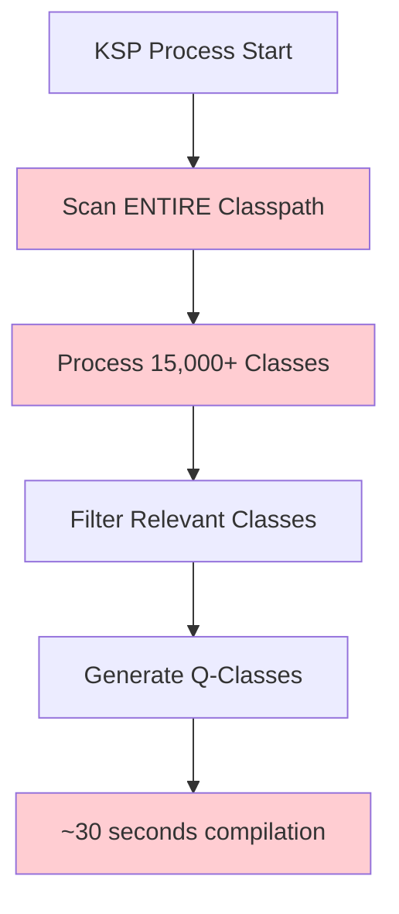

### After Optimization  
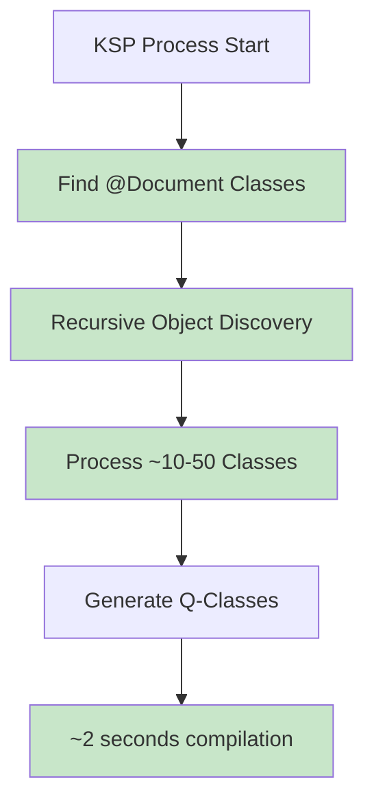

**Key Optimizations:**
- ✅ **Targeted Class Discovery** - Only process referenced classes
- ✅ **Top-level Utility Functions** - No object instantiation overhead
- ✅ **Efficient Dependency Tracking** - Recursive but bounded collection
- ✅ **Incremental Compilation** - KSP handles change detection

## Error Handling & Logging

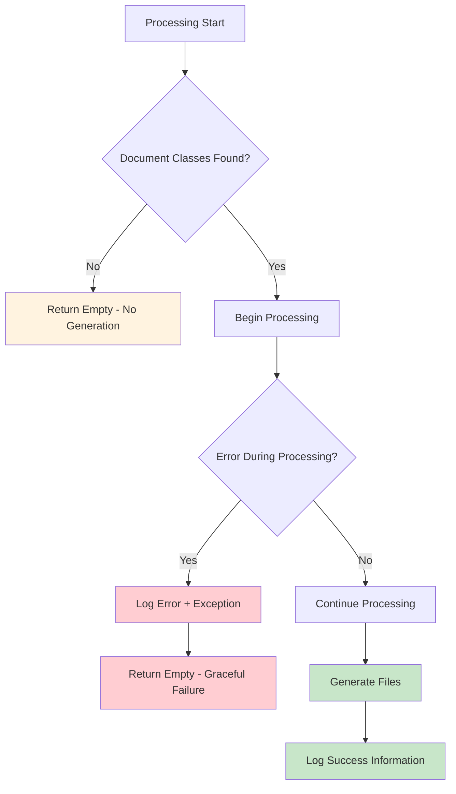

**Error Handling Strategy:**
- ✅ **Graceful Degradation** - Compilation continues even if processor fails
- ✅ **Detailed Logging** - KSPLogger provides detailed error information
- ✅ **Exception Containment** - runCatching prevents processor crashes
- ✅ **User-Friendly Messages** - Clear logging for debugging

## Integration Points

### KSP Integration
- **SymbolProcessorProvider** - Entry point for KSP runtime
- **Resolver** - Provides access to compilation symbols
- **CodeGenerator** - Handles file creation and output
- **Dependencies** - Manages incremental compilation tracking

### KotlinPoet Integration
- **FileSpec** - Represents generated Kotlin files
- **TypeSpec** - Represents classes and objects
- **PropertySpec** - Represents class properties
- **AnnotationSpec** - Handles annotation generation

### Spring Data Elasticsearch Integration
- **@Document** - Primary trigger annotation for processing
- **@Field** - Field type and configuration source
- **@MultiField** - Multi-field configuration support
- **FieldType** - Elasticsearch field type enumeration

## Future Enhancements

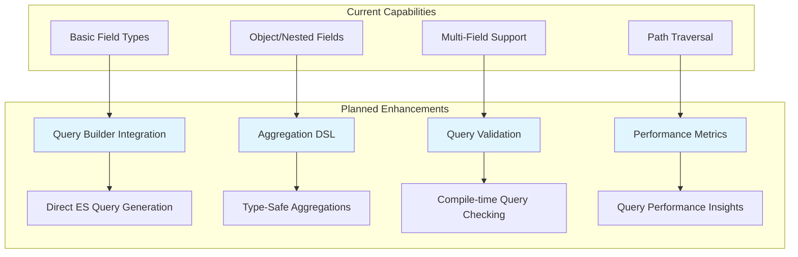

## Conclusion

The QElasticsearch annotation processor represents a sophisticated code generation system that:

- ✅ **Efficiently processes** only the classes that matter
- ✅ **Generates type-safe** DSL code with full IDE support  
- ✅ **Handles complex scenarios** like nested objects and multi-fields
- ✅ **Provides excellent performance** through targeted processing
- ✅ **Maintains compatibility** with existing Spring Data Elasticsearch code
- ✅ **Offers extensibility** for future enhancements

The architecture is designed for **performance**, **maintainability**, and **extensibility**, making it a solid foundation for type-safe Elasticsearch query building in Kotlin.